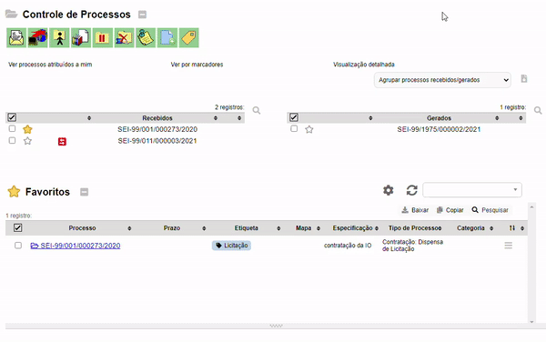
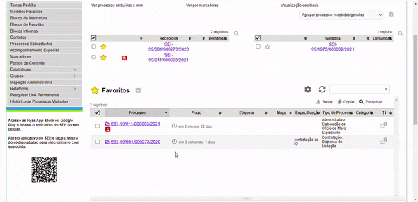
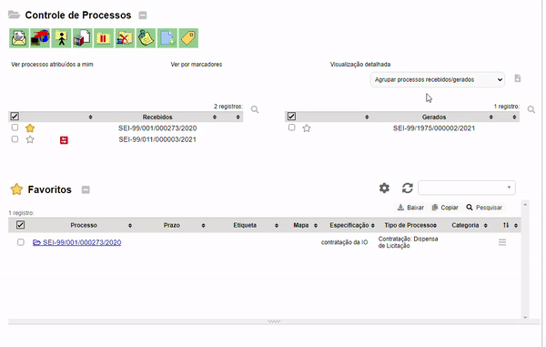
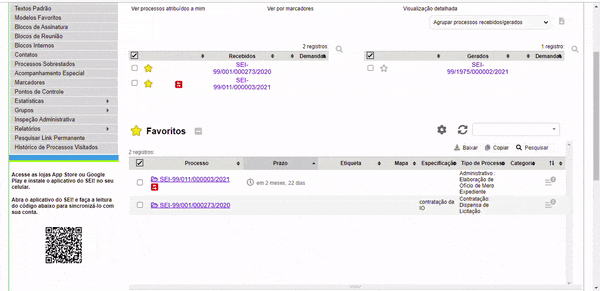
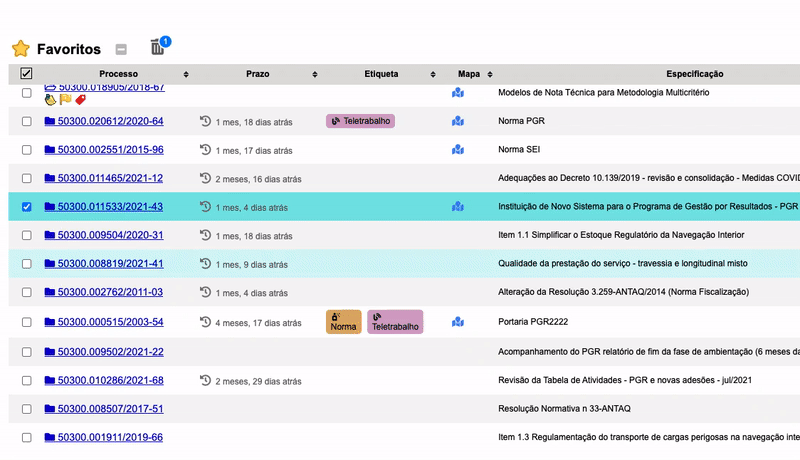
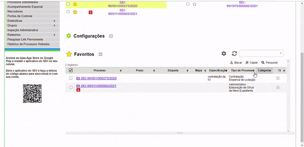
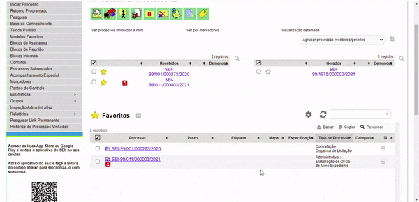
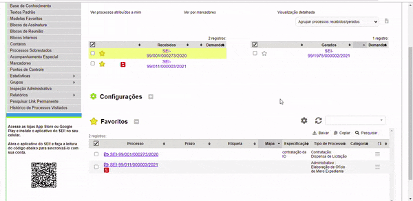
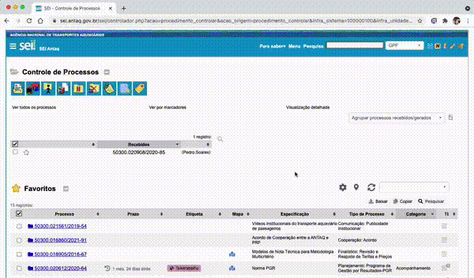

#  |  SEI Pro 

##  Gerenciar processos favoritos

Guarde num painel só seu os processos que você acompanha de perto — mesmo os que já saíram da sua unidade. Cada favorito pode ter **prazo**, **etiqueta colorida**, **categoria**, **localização no mapa** e uma **especificação** própria, e o painel aparece no alto da tela Controle de Processos.

> 

### Adicionar um favorito

* **Pela árvore do processo:** clique na **estrela** ao lado do número do processo, no alto da árvore;
* **Pela tela Controle de Processos:** clique na **estrela** ao lado do processo, na tabela;
* **Ao enviar o processo:** na tela **Enviar Processo**, marque **Manter processo em Favoritos**. Ali mesmo dá para escolher a categoria, o prazo e as etiquetas.

A estrela fica amarela e o processo passa a aparecer no painel **Favoritos**. Para retirar, clique de novo na estrela ou use **Remover favorito** no painel.

### O painel Favoritos

Na tela Controle de Processos, o painel mostra uma tabela com as colunas **Processo**, **Prazo**, **Etiqueta**, **Mapa**, **Especificação**, **Tipo de Processo** e **Categoria**.

No alto do painel:

| Controle | O que faz |
| -------- | --------- |
| ⚙ **Configurações** | Baixar e carregar a lista de favoritos (cópia de segurança) |
| ↻ **Atualizar** | Recarrega as informações dos processos |
| Caixa de categorias | Mostra só os favoritos de uma categoria |
| **Baixar** / **Copiar** | Exporta a tabela para planilha ou área de transferência |
| **Pesquisar** | Filtra a tabela |
| **−** | Recolhe o painel |

Clique no cabeçalho de uma coluna para ordenar, ou arraste as linhas pela alça (≡) para definir uma ordem própria.

> 

### Etiquetas

Marque o favorito com uma etiqueta de texto, com a cor e o ícone que preferir — por exemplo, *Aguardando manifestação* em laranja.

> 

### Prazo

Defina uma data para o favorito. A coluna **Prazo** mostra quanto falta ou quanto já passou.

> 

Em **Edição Avançada**, o prazo pode ser contado:

* a partir **da data de assinatura de um documento** do processo (por exemplo, a partir do ofício enviado);
* a partir **de uma data específica**;

e o resultado pode ser exibido **em tempo relativo** ("há 3 semanas") ou **em número de dias**. Também é possível pedir um **aviso quando um novo documento for assinado** no processo.

> 

### Categorias

Agrupe os favoritos em categorias — *Contratos*, *Fiscalização*, *Aguardando outras unidades* — e filtre o painel pela caixa de categorias.

> 

### Especificação

Escreva uma especificação só sua para o favorito, diferente da cadastrada no SEI — útil para lembrar do que se trata cada processo.

> 

### Mapa

Associe um local ao favorito, clicando no mapa ou pesquisando um endereço. O botão **Mapa de favoritos** mostra todos os processos marcados num mapa só — útil para obras, fiscalizações e vistorias.

> 

> **De onde vem o mapa.** As imagens são as do [OpenStreetMap](https://www.openstreetmap.org), e a busca de endereços usa o serviço Nominatim, do mesmo projeto. Isso só acontece quando você abre o mapa: nesse momento o seu navegador pede as imagens da região ao OpenStreetMap e, se você pesquisar, envia o endereço digitado. **Nenhum dado do processo sai daqui** — nem o número, nem o conteúdo —, e o SEI Pro não pede a localização do seu computador.

### Cópia de segurança

Em ⚙ **Configurações**, use **Baixar Favoritos** para salvar a lista num arquivo e **Carregar Favoritos** para restaurá-la — por exemplo, ao trocar de computador.

> 

### Como ativar

A função vem **ligada** de fábrica. Ela fica nas [Configurações do SEI Pro](../pages/DESATIVARFUNCOES.md), aba **Geral**, seção **Controle de Processos**, opção **Processos Favoritos**.

### Bom saber

* **Os favoritos ficam guardados neste navegador, neste computador.** Eles não aparecem para outras pessoas nem em outra máquina. Se os dados de navegação forem apagados, a lista se perde — **baixe uma cópia de segurança de vez em quando**.
* Para proteger melhor a lista, o SEI Pro também pede permissão para usar o armazenamento de arquivos do navegador. Se o painel mostrar o aviso de que o navegador *não autorizou o uso*, clique em **Re-autorize**.
* **Processo sigiloso não entra nos favoritos.** Os dados dele só ficam disponíveis depois da senha de acesso, que o SEI Pro não pede. Ao clicar na estrela de um processo sigiloso, aparece um aviso e nada é adicionado.
* As versões mais novas do SEI têm um recurso de favoritos próprio (menu **Favoritos** do SEI). Os dois são independentes: o favorito do SEI Pro não aparece no do SEI, e vice-versa.

## Próximo item

> [Controle de Prazos](../pages/PRAZOS.md)
