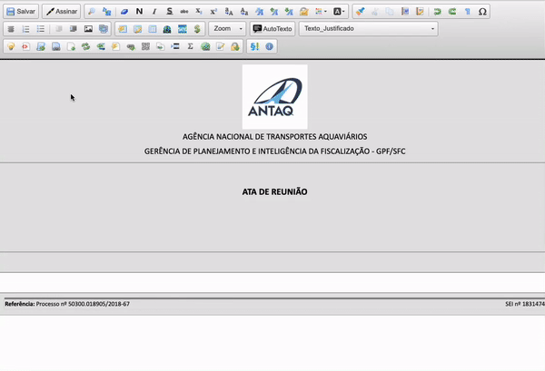

#  |  SEI Pro 

##  Ferramentas de Inteligência Artificial (ChatGPT)

Aproveite todo o potencial da inteligência artificial do ChatGPT diretamente no editor de documentos do SEI.

Utilize alguns dos nossos prompts de integração predeterminados...

|  Tipo de Interação  |
| ------------------- | 
|  Discorra sobre  | 
|  Resuma em linguagem simples o seguinte trecho:  | 
|  Reescreva o seguinte trecho:  | 
|  Descubra a base legal para o seguinte tema:  | 
|  Traga o texto legal, sem explicações, do seguintes dispositivo legal:  | 
|  Traduza para português a frase:  | 
|  Faça uma análise crítica sobre o seguinte tópico:  | 
|  Liste até 10 sinônimos em português para a palavra:  | 
|  Conclua o seguinte texto:  | 
|  Extraia as palavras-chave deste texto:  | 
|  Converta minha nota curta em uma ata de reunião:  | 
|  Faça um resumo em tópicos do seguinte texto:  | 
|  Escreva um texto longo e detalhado, cite fontes e dispositivos legais que embase a argumentação sobre o seguinte tema:  | 
|  Amplie e reescreva o texto a seguir, em voz ativa, com correções gramaticais, citando as fontes e adicinando coesão às orações:  | 
|  Crie um Parecer técnico detalhado, cite fontes e legislação, traga argumentos a favor e contrários sobre o tema:  |

.. ou apenas selecione a última opção `-` e descreve qual a instrução que gostaria de perguntar ao Chatbot.

Ainda é possível adicionar um texto de exemplo, para começar a explorar as potencialidades da ferramenta.

>  

Para utilizar a API do ChatGPT será preciso se cadastrar na plataforma.

Siga o passo-a-passo abaixo para cadastrar suas credenciais de acesso:

1. Acesse o site do OpenAI ([https://beta.openai.com/](https://beta.openai.com/)) e clique em "Sign Up" no canto superior direito da tela.

2. Preencha o formulário de cadastro com seus dados pessoais e crie uma senha.
É possível logar com sua conta Google ou Microsoft.

3. Verifique seu e-mail e clique no link de confirmação enviado pela OpenAI.

4. Verifique seu celular e adicione o código de verificação enviado por SMS.

5. Faça login na sua conta OpenAI.

6. Clique em `"Upgrade"` no menu do lado direito da tela ou acesse o endereço [https://beta.openai.com/account/billing/overview](https://beta.openai.com/account/billing/overview).

7. Selecione a opção `"USER > Create API Key"`.

8. Clique em `"Create new secret key"` para gerar sua chave de API.

9. Será adicionado um crédito promocional de $18, para utilização em até 4 (quatro) meses.
Caso deseje prosseguir após isso, adicione suas informações de pagamento no menu `"Billing"`.
Consulte condições de precificação da plataforma em: [https://openai.com/api/pricing/](https://openai.com/api/pricing/)

10. Copie sua chave secreta de API, pois ela será necessária para fazer chamadas à API. 
Cole-a na caixa de texto que aparecerá ao clicar no ícone [Ferramentas IA](../img/icon-ferramentasia.png).

> **ATENÇÃO: Os dados são processados pelo serviço OpenAI. Não envie informações restritas ou sigilosas.**

> 
## Próximo item

> [PAGE](../pages/PAGE.md)
