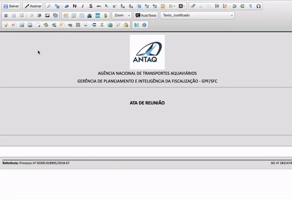

#  |  SEI Pro 

##  Ferramentas de Inteligência Artificial (ChatGPT e Gemini)

Use o **ChatGPT (OpenAI)** ou o **Gemini (Google)** direto no SEI: peça um resumo do processo, reescreva um parágrafo em linguagem simples, procure erros gramaticais ou dados pessoais num texto, e leve a resposta para um documento — sem copiar e colar entre sistemas.

> 

> **Atenção:** o texto que você envia é processado pelos servidores da **OpenAI** ou do **Google**, fora do seu órgão. **Não envie informações sigilosas, restritas ou dados pessoais.** Antes de usar, verifique se o seu órgão permite o uso desses serviços.

### Onde fica

| Onde | O que faz |
| ---- | --------- |
| Barra de botões do processo › **Ferramentas de IA** | Abre o chat, com acesso aos documentos do processo |
| Barra do editor de documentos › **Inserir texto de inteligência artificial** | Trabalha sobre o **texto selecionado** ou **todo o documento** e insere a resposta no editor |

### Primeiro uso

1. Clique em **Ferramentas de IA** e escolha a plataforma: **ChatGPT (OpenAI)** ou **Gemini (Google)**;
2. Leia o termo de uso responsável e clique em **Estou ciente e entendo os riscos**;
3. Cadastre a sua **chave de API** (veja abaixo como obter) e clique em **Salvar**;
4. Clique em **Recarregar**.

### Como obter a chave

**ChatGPT (OpenAI)**

1. Acesse [platform.openai.com](https://platform.openai.com/) e crie uma conta (é possível entrar com Google ou Microsoft);
2. Confirme o e-mail e o celular;
3. No painel, abra **API Keys** e clique em **Create new secret key**;
4. Copie a chave — ela só é exibida uma vez;
5. O uso da API é **pago** e cobrado pela OpenAI. Cadastre um meio de pagamento em **Billing** e consulte os [preços](https://openai.com/pricing).

**Gemini (Google)**

1. Acesse o [Google AI Studio](https://aistudio.google.com/app/apikey) com uma conta Google;
2. Aceite os termos e clique em **Criar chave de API**;
3. Copie a chave e guarde-a em local seguro.

> A chave é pessoal, como uma senha. Não a compartilhe. Para apagá-la do navegador, use **Apagar chave de API** nas configurações da ferramenta.

### O que dá para pedir

Escreva o que quiser na caixa de mensagem, ou use um dos comandos prontos:

| Comando | Para que serve |
| ------- | -------------- |
| Resuma | Resume o texto |
| Reformule em linguagem simples | Reescreve em linguagem acessível ao cidadão |
| Amplie o conteúdo | Desenvolve um texto curto |
| Crie uma estrutura de tópicos | Organiza o texto em tópicos |
| Converta em uma ata de reunião | Transforma anotações em ata |
| Crie um parecer técnico | Monta um parecer sobre o tema |
| Descubra a base legal do tema | Sugere normas relacionadas — **sempre confira** |
| Discorra sobre | Escreve sobre um assunto |
| Faça uma análise crítica sobre o tema | Aponta pontos fortes e fracos |
| Encontre erros gramaticais | Revisa o português |
| Encontre dados sensíveis (LGPD) | Aponta dados pessoais no texto |
| Extraia as palavras-chave | Lista os termos principais |
| Sugira um encaminhamento | Propõe o próximo passo |
| Traduza para o português | Traduz o texto |

Na janela do processo, você também pode:

* **Resumir todo o processo** ou **adicionar documentos do processo** ao pedido;
* **Pesquisar em outro processo**, informando o número;
* **Criar documento SEI** a partir da resposta, escolhendo o tipo de documento;
* **Ver Histórico** das conversas.

### Configurações avançadas

Para quem conhece os modelos de linguagem: é possível escolher o **modelo**, a **temperatura** (criatividade), o **comprimento máximo** da resposta, o **Top P**, as **penalidades de frequência e presença** e uma **instrução do sistema**. **Resetar configurações** volta aos valores padrão.

### Como ativar

A função vem **ligada** de fábrica. Ela fica nas [Configurações do SEI Pro](../pages/DESATIVARFUNCOES.md), aba **Geral**, seção **Editor de Texto**, opção **Ferramentas de Inteligência Artificial**.

### Bom saber

* O SEI Pro **não intermedeia** as mensagens: elas vão do seu navegador direto para a OpenAI ou o Google, com a sua chave. O SEI Pro não recebe financiamento dessas empresas.
* A IA **erra**, inventa normas e cita fontes que não existem. **Toda resposta precisa de revisão humana**, e a responsabilidade pelo documento assinado é de quem assina.
* A chave fica guardada nas configurações da extensão, neste navegador (aba **Base de Dados**).

## Próximo item

> [Gerar Certidão de Documento Oficial com Sigilo (LAI e LGPD)](../pages/CERTIDAOSIGILO.md)
