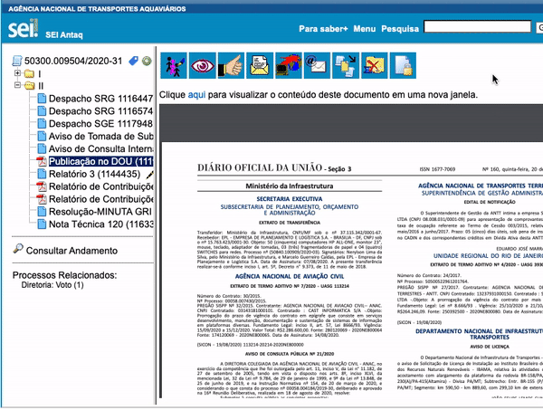
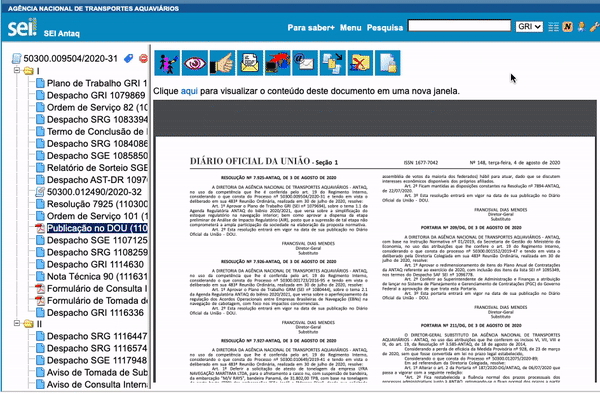

#  |  SEI Pro 

##  Verificar código de integridade (Hashcode)

Essa funcionalidade adiciona ao visualizador de documentos do SEI a verificação de código de integridade (Hashcode).

>  

O botão de **Verificar código de integridade (Hashcode)** somente aparece nos documentos do tipo **Anexo**

Mas pra que serve o **HASHCODE**?

> Se você obteve uma cópia de um documento e não tem certeza se é o documento original, saiba que é possível gerar um certificado para a sua cópia digital e conferir se bate com o certificado original.
>
> Todo arquivo digital “gera um certificado”, sem precisar de uma autoridade ou assinatura eletrônica. A mágica está no resultado matemático de um algoritmo de certificação chamado função hash.
> 
> O processo garante que o resultado (hashcode ou digest) seja único, como um CPF para cada arquivo virtual. 
> 
> Qualquer alteração no arquivo faz com que o hashcode  também mude. Se o hashcode  não bater com o arquivo público, significa que essa cópia é adulterada!

Dica: Confira postagem sobre [Como verificar a autenticidade de documentos digitais](https://www.instagram.com/p/CIZ-8DjnEyv/).

Precisa verificar se uma cópia do documento é idêntica ao arquivo anexado ao processo? Acesse a opção **Comparar documento**

>  

Dica: Quando divulgar documentos  públicos, também publique os seus hashcodes! Os padrões mais utilizados são **MD5** e **SHA256**.

Quer saber mais sobre autenticidade de documentos, começe com esse artigo: [Autenticidade e integridade de documentos públicos
](https://medium.com/@peterkrauss/autenticidade-e-integridade-de-documentos-p%C3%BAblicos-aabea5389f4b)
