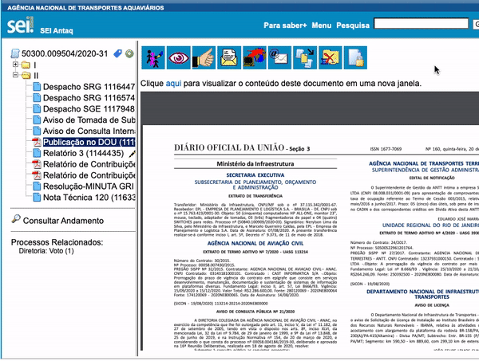
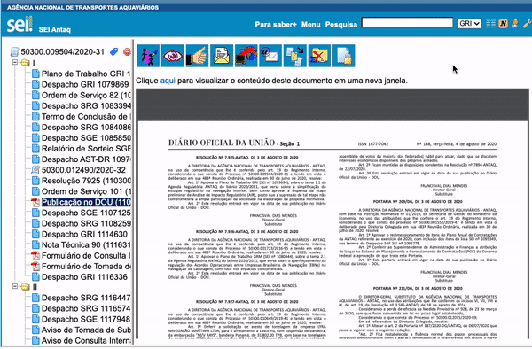

#  |  SEI Pro 

##  Verificar código de integridade (Hashcode)

Recebeu a cópia de um arquivo e quer ter certeza de que ela é **idêntica** ao documento que está no processo? Esta função calcula o **código de integridade** (hash) dos documentos externos do SEI e compara com o de qualquer arquivo do seu computador.

> 

### Para que serve o hash

Todo arquivo digital tem uma espécie de "impressão digital" matemática, o **hash**. Ele é calculado a partir do conteúdo do arquivo e funciona como um CPF: dois arquivos idênticos têm o mesmo hash, e **qualquer alteração — uma vírgula, um pixel — muda o código inteiro**.

Por isso, comparar hashes é o jeito mais simples de provar que uma cópia não foi adulterada, sem precisar de assinatura digital ou autoridade certificadora.

### Como usar

1. Na árvore do processo, clique num **documento externo** (PDF, imagem, planilha etc.);
2. Na barra de botões do documento, clique em **Verificar código de integridade (Hashcode)**;
3. A janela mostra os códigos **MD5** e **SHA256** do documento que está no SEI;
4. Para comparar com um arquivo do computador, clique em **Comparar documento** e escolha o arquivo;
5. O SEI Pro calcula o hash da sua cópia e mostra se ele é **igual** ao do documento do processo.

> 

### Como ativar

A função aparece sempre que o SEI Pro está instalado, nos documentos do tipo **externo**.

### Bom saber

* O cálculo é feito **no seu computador**: o arquivo escolhido para comparação não é enviado a lugar nenhum.
* Documentos **gerados no SEI** (os que abrem no editor) não têm o botão, porque não são arquivos anexados.
* **Dica:** ao divulgar documentos públicos, publique também o hash — assim qualquer pessoa pode conferir a autenticidade da cópia que recebeu. Os padrões mais usados são **MD5** e **SHA256**.

Para saber mais: [Autenticidade e integridade de documentos públicos](https://medium.com/@peterkrauss/autenticidade-e-integridade-de-documentos-p%C3%BAblicos-aabea5389f4b).

## Próximo item

> [Reproduzir vídeo na visualização de documentos](../pages/PLAYVIDEO.md)
