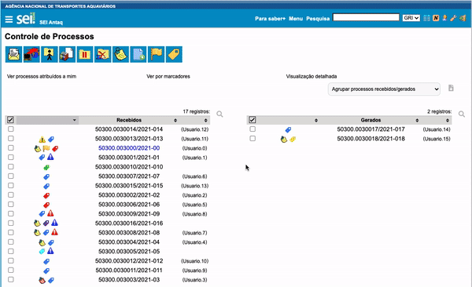

#  |  SEI Pro 

##  Histórico de processos visitados

Sabe aquele processo que você abriu ontem e não lembra o número? O SEI Pro guarda uma lista dos **processos que você visitou**, com o tipo, a especificação e quando foi o último acesso.

> 

### Como usar

1. No menu lateral do SEI, clique em **Histórico de Processos Visitados** (fica no fim do menu);
2. Uma janela lista os processos, do acesso mais recente para o mais antigo;
3. Clique no número para abrir o processo em uma nova aba.

Clique no cabeçalho das colunas para ordenar a lista.

### Como ativar

A função vem **ligada** de fábrica. Ela fica nas [Configurações do SEI Pro](../pages/DESATIVARFUNCOES.md), aba **Geral**, seção **Controle de Processos**, opção **Histórico de processos visitados**.

### Bom saber

* A lista fica guardada **somente neste navegador, neste computador**. Ela não aparece em outra máquina e é apagada se você limpar os dados de navegação.
* Ela começa a ser montada a partir da instalação do SEI Pro — não há como recuperar acessos anteriores, nem o SEI Pro lê o histórico do seu navegador.
* Cada processo aparece uma única vez, com a data do acesso mais recente. São guardados cerca de 500 processos; os mais antigos saem da lista.
* A lista é gravada quando o SEI Pro carrega os dados do processo aberto. Se a opção [Desativar consultas adicionais](../pages/DESATIVACONSULTAS.md) estiver ligada, novos acessos não entram no histórico.

## Próximo item

> [Pesquisar link permanente](../pages/LINKPERMANENTE.md)
