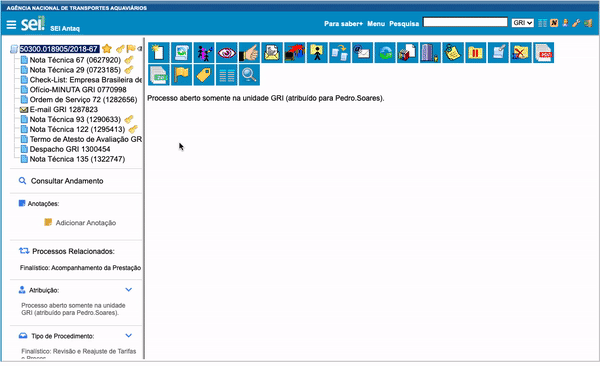

#  |  SEI Pro 

##  Informações adicionais na árvore do processo

Abaixo da árvore de documentos, o SEI Pro mostra um **painel com as principais informações do processo** — atribuição, marcador, interessados, assuntos, nível de acesso e outras — e permite **alterar várias delas ali mesmo**, sem abrir o formulário do processo.

> 

### O que aparece no painel

| Informação | O que dá para fazer |
| ---------- | ------------------- |
| **Anotações** | Ver, escrever, marcar prioridade e apagar — veja [Anotação pela árvore](../pages/NOTAARVORE.md) |
| **Atribuição** | Ver a quem o processo está atribuído e trocar |
| **Marcador** | Ver, trocar ou remover o marcador e o prazo — veja [Controle de Prazos](../pages/PRAZOS.md) |
| **Acompanhamento Especial** | Ver e editar o grupo, a observação e a [reabertura programada](../pages/REABRIRPROCESSOS.md) |
| **Tipo de Procedimento** | Ver e trocar o tipo; ver a especificação e marcá-la como [urgente](../pages/URGENTE.md) |
| **Interessados** | Ver a lista e **pesquisar outros processos do mesmo interessado** |
| **Assuntos** | Ver a classificação |
| **Nível de Acesso** | Ver se é público, restrito ou sigiloso |
| **Observações** | Ver as observações das unidades |
| **Bloco Interno** | Ver em quais blocos o processo está |

Cada bloco pode ser recolhido pela seta ao lado do título.

### Escolher o que mostrar

1. Passe o mouse sobre o número do processo e clique em **Personalizar Menu**;
2. Abra a aba **Painel**;
3. Ligue só as informações que interessam e arraste para mudar a ordem.

> 

### Como ativar

A função vem **ligada** de fábrica. Ela fica nas [Configurações do SEI Pro](../pages/DESATIVARFUNCOES.md), aba **Geral**, seção **Árvore e Visualização de Documentos**, opção **Informações adicionais na árvore do processo**.

### Bom saber

* As alterações feitas pelo painel são as mesmas do formulário do SEI e ficam registradas no andamento quando o SEI registra.
* O painel é montado com os dados que o SEI Pro lê do processo. Se a opção [Desativar consultas adicionais](../pages/DESATIVACONSULTAS.md) estiver ligada, ele não aparece.
* Em processos sigilosos, algumas informações podem não ser carregadas.

## Próximo item

> [Anotação diretamente pela árvore do processo](../pages/NOTAARVORE.md)
