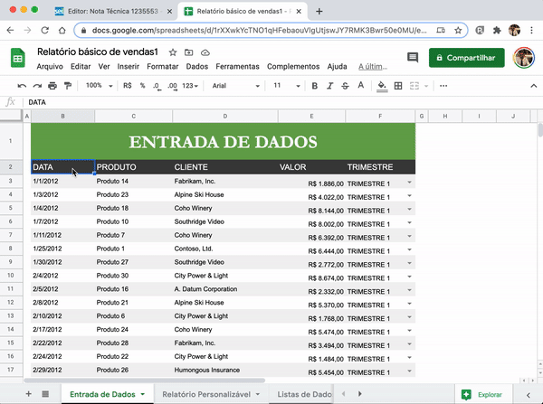

#  |  SEI Pro 

##  Inserir Documento Externo

Essa funcionalidade adiciona ao editor de texto do SEI a importação de documento externo, anexando um arquivo em formato HTML (linguagem de marcação utilizada na construção de páginas na Web) ou um link do Google Docs ou Google Planilhas.

>  

Converta seus documentos Word em formato HTML. Importe sem perder a formatação original e dentro dos padrões exigidos pelo SEI.

>  

Erros com caracteres não indentificados? Antes do envio, marque a opção **Corrigir erros de codificação de documentos Word**:

>  

## Importando do Google Docs

Importe documentos diretamente do Google Docs, sem perder a formatação original e dentro dos padrões exigidos pelo SEI.

> 

Antes de importar, confira se o documento está acessível por qualquer pessoa na internet.

> 

Função em fase experimental (Beta), algumas formatações do documento podem não refletir fielmente ao documento original no Google Docs.

Caso tenha identificado alguma consistência, envie um e-mail para [pedrohsoares.adv@gmail.com](mailto:pedrohsoares.adv@gmail.com).

## Importando do Google Planilhas

Importe documentos diretamente do Google Planilhas, sem perder a formatação original e dentro dos padrões exigidos pelo SEI.

> 

Antes de importar, confira se o documento está **[Publicado na Web](https://support.google.com/docs/answer/183965?hl=pt-BR)**.

> 

**Atenção:** O URL do documento publicado na web (Arquivo >> Publicar na Web) é diferente do URL da planilha.

Função em fase experimental (Beta), algumas formatações do documento podem não refletir fielmente ao documento original no Google Docs.

Caso tenha identificado alguma consistência, envie um e-mail para [pedrohsoares.adv@gmail.com](mailto:pedrohsoares.adv@gmail.com).

## Próximo item

> [Adicionar estilo a tabela](./ESTILOTABELA.md)
