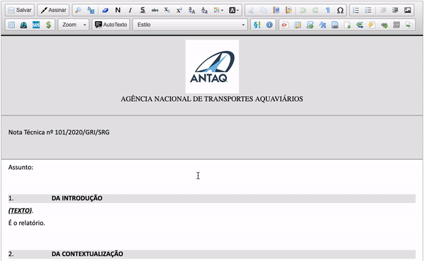
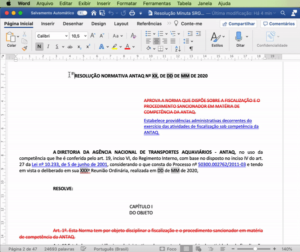
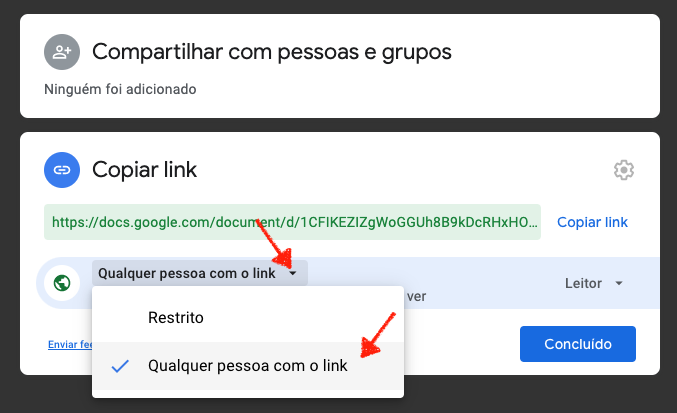

#  |  SEI Pro 

##  Inserir Documento Externo

Essa funcionalidade adiciona ao editor de texto do SEI a importação de documento externo, anexando um arquivo em formato HTML (linguagem de marcação utilizada na construção de páginas na Web) ou um link do Google Docs.

>  

Converta seus documentos Word em formato HTML. Importe sem perder a formatação original e dentro dos padrões exigidos pelo SEI.

>  

## Importando do Google Docs

Importe documentos diretamente do Google Docs, sem perder a formatação original e dentro dos padrões exigidos pelo SEI.

> 

Antes de importar, confira se o documento está acessível por qualquer pessoa na internet.

> 

Função em fase experimental (Beta), algumas formatações do documento podem não refletir fielmente ao documento original no Google Docs.

Caso tenha identificado alguma consistência, envie um e-mail para [pedrohsoares.adv@gmail.com](mailto:pedrohsoares.adv@gmail.com).

## Próximo item

> [Adicionar estilo a tabela](./ESTILOTABELA.md)
