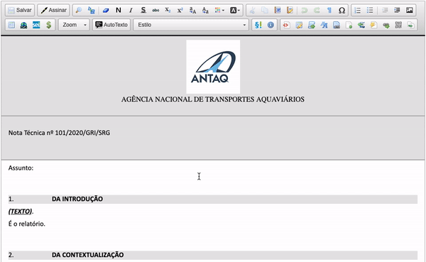
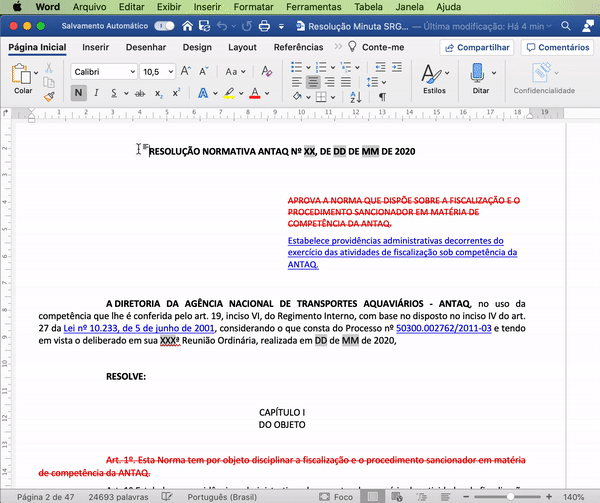
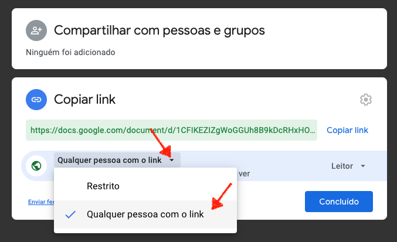

#  |  SEI Pro 

##  Inserir conteúdo externo (Word, HTML, Google Docs e Google Planilhas)

Escreveu o texto no Word ou no Google Docs e agora precisa passar para o SEI? Em vez de copiar e colar — e perder tabelas, recuos e formatação —, **importe o arquivo direto no editor**. O SEI Pro converte o conteúdo para os **estilos aceitos pelo SEI**.

> 

### Como abrir

No editor do SEI, clique no botão **Inserir conteúdo externo**. A janela tem três abas: **Arquivo**, **Google Docs** e **Google Planilhas**.

### Importar um arquivo do Word ou HTML

1. Na primeira aba, escolha o arquivo — **Word (.docx)** ou **HTML**;
2. Marque as opções, se precisar:
   * **Corrigir erros de codificação de documentos Word** — quando acentos aparecem trocados (como `ç` no lugar de `ç`);
   * **Substituir todo o documento pelo conteúdo externo** — apaga o texto atual do editor e coloca o importado no lugar. Desmarcada, o conteúdo entra onde está o cursor;
   * **Substituir campos dinâmicos no documento** — troca campos como `#processo` e `#interessados` pelos dados do processo (veja [Dados do processo e campos dinâmicos](../pages/DADOSPROCESSO.md));
3. Confirme.

> 

>  

### Importar do Google Docs

1. No Google Docs, clique em **Compartilhar** e deixe o documento acessível a **qualquer pessoa com o link**;
2. Copie o endereço do documento;
3. Na aba **Google Docs**, cole o endereço e confirme.

> 

> 

### Importar do Google Planilhas

Tabelas do Google Planilhas também podem ser importadas. Veja o passo a passo em [Inserir tabela do Google Planilhas](../pages/INSERIRPLANILHA.md).

### Como ativar

O botão aparece sempre no editor do SEI quando o SEI Pro está instalado.

### Bom saber

* O Word é convertido **no seu computador**, dentro do navegador. Já a importação do Google Docs e do Google Planilhas busca o conteúdo nos servidores do Google, e por isso exige que o documento esteja compartilhado.
* O SEI aceita um conjunto limitado de formatações. Cores de fundo, fontes especiais, caixas de texto e objetos do Word podem ser simplificados ou descartados na conversão. Revise o resultado antes de salvar.
* Ao **colar** texto de outros programas, o SEI Pro também faz uma **limpeza automática** do conteúdo, removendo restos invisíveis de formatação que levam o SEI a recusar o documento com a mensagem *"Documento possui conteúdo não permitido"*.
* Encontrou uma formatação que não foi convertida direito? Relate em [Issues no GitHub](https://github.com/pedrohsoaresadv/sei-pro/issues).

## Próximo item

> [Inserir tabela do Google Planilhas](../pages/INSERIRPLANILHA.md)
