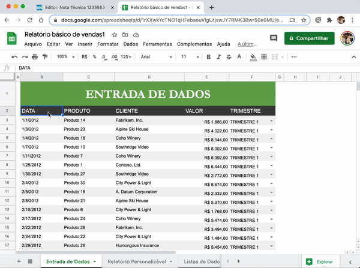

#  |  SEI Pro 

##  Inserir tabela do Google Planilhas

Leve uma tabela do **Google Planilhas** para um documento do SEI sem digitar tudo de novo. O SEI Pro importa a planilha publicada e a transforma numa tabela do editor.

> 

### Antes de importar: publique a planilha na web

1. No Google Planilhas, abra o menu **Arquivo › Compartilhar › Publicar na Web**;
2. Escolha a **aba** da planilha que deseja importar e clique em **Publicar**;
3. Copie o **endereço gerado pela publicação**.

> 

> **Atenção:** o endereço da publicação é **diferente** do endereço que aparece na barra do navegador quando você edita a planilha. Use o endereço da publicação, que começa com `https://docs.google.com/spreadsheets/d/e/`.

Mais detalhes na ajuda do Google: [Publicar na Web](https://support.google.com/docs/answer/183965?hl=pt-BR).

### Como importar

1. No editor do SEI, clique em **Inserir conteúdo externo**;
2. Abra a aba **Google Planilhas**;
3. Cole o endereço da publicação;
4. Se quiser, marque **Substituir todo o documento pelo conteúdo externo**;
5. Confirme.

### Bom saber

* **Publicar na web deixa a planilha visível para qualquer pessoa com o endereço.** Não publique dados pessoais ou restritos. Depois de importar, você pode interromper a publicação no mesmo menu.
* Formatações da planilha (cores, fórmulas, células mescladas complexas) podem ser simplificadas.
* Para dar cores e cabeçalho à tabela importada, use [Adicionar estilo à tabela](../pages/ESTILOTABELA.md).
* Para importar arquivos do Word ou do Google Docs, veja [Inserir conteúdo externo](../pages/INSERIRDOC.md).

## Próximo item

> [Inserir dados do processo e campos dinâmicos](../pages/DADOSPROCESSO.md)
