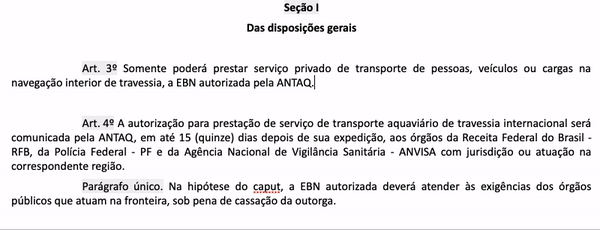
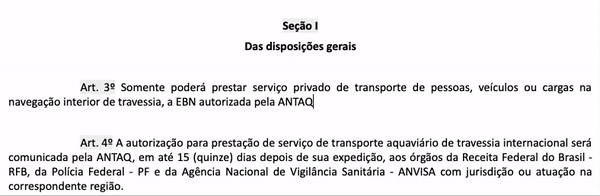
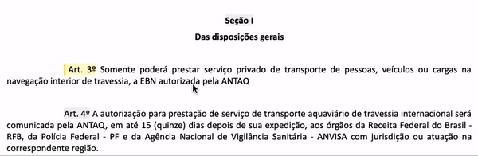
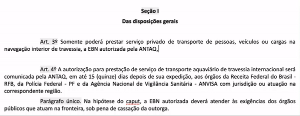
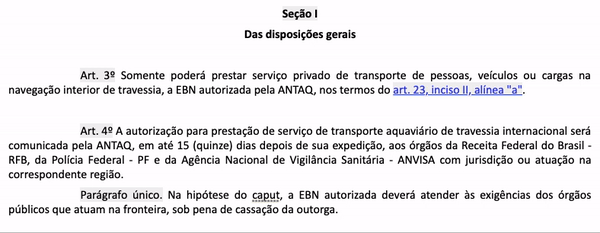
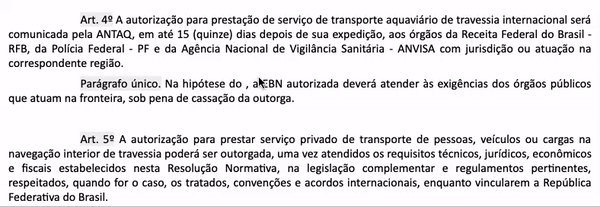
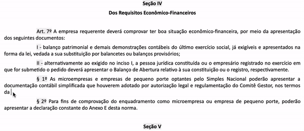

#  |  SEI Pro 

##  Enumerar Normas (Legística)

Essa ferramenta adiciona ao [Sistema Eletrônico de Informações (SEI)](https://softwarepublico.gov.br/social/sei) a função de enumerar normas conforme as regras de redação legislativa da [Lei Complementar nº 95, de 26 de fevereiro de 1998](http://www.planalto.gov.br/ccivil_03/leis/lcp/lcp95.htm) e do [Decreto nº 9.191, de 1º de novembro de 2017](http://www.planalto.gov.br/ccivil_03/_ato2015-2018/2017/decreto/D9191.htm).

Criada a partir da necessidade de revisão e consolidação dos atos normativos inferiores a decreto ([Decreto nº 10.139, de 28 de novembro de 2019](http://www.planalto.gov.br/ccivil_03/_ato2019-2022/2019/decreto/D10139.htm)), a ferramenta enumera automaticamente títulos, capítulos, seções, artigos, parágrafos, incisos e alíneas de suas normas criadas a partir do editor de texto do SEI.

Adicionou um novo artigo bem no meio do documento? Não se preocupe, fazemos a enumeração pra você!

## Como utilizar?

No editor de textos do SEI, ative a enumeração automática do **SEI Legis §!** no botão  

 

As enumerações digitadas manualmente serão convertidas em referências dinâmicas.

> `CAPÍTULO II`
>
> DA AUTORIZAÇÃO PARA OPERAR
> 
> `Seção I`
>
> Das disposições gerais
> 
> `Art. 9º` Somente poderá prestar serviço público de transporte de passageiros e veículos na navegação interior de travessia, a EBN autorizada pela ANTAQ.
>
> `Parágrafo único.` A autorização de que trata o caput é intransferível e terá vigência a partir da data da sua publicação no Diário Oficial da União - DOU.

## Novos dispositivos

Para criar nos dispositivos, inicie seu texto com a **referência dinâmica** correspondente:

Atualmente são suportadas as seguintes referências dinâmicas:

| Tipo de Dispositivo  |  Referências Dinâmicas  |  Enumeração Gerada  |
| ------------------- | ------------------- | ------------------- |
|  Anexos |  `ANEXO.` |  `ANEXO I` ou `ANEXO ÚNICO`, `ANEXO II`, `ANEXO III`, `ANEXO IV` ... |
|  Títulos |  `TIT.` |  `TÍTULO I`, `TÍTULO II`, `TÍTULO III`, `TÍTULO IV` ... |
|  Capítulos |  `CAP.` |  `CAPÍTULO I`, `CAPÍTULO II`, `CAPÍTULO III`, `CAPÍTULO IV` ... |
|  Seções |  `Sec.` |  `Seção I`, `Seção II`, `Seção III`, `Seção IV` ... |
|  Subseções |  `Sub.` |  `Subseção I`, `Subseção II`, `Subseção III`, `Subseção IV` ... |
|  Artigos |  `Art.` |  `Art. 1º`, `Art. 2º`, `Art. 3º`, `Art. 4º` ... |
|  Parágrafos |  `§` |  `Parágrafo único.` ou `§ 1º`, `§ 2º`, `§ 3º` ... |
|  Incisos |  `Inc.` |  `I -`, `II -`, `III -`, `IV -` ... |
|  Alíneas |  `Alin.` |  `a)`, `b)`, `c)`, `d)` ... |
|  Iitens |  `Item.` |  `1.`, `2.`, `3.`, `4.` ... |

> Ao utilizar `ANEXO.`, todas as demais referências reiniciarão sua contagem.

 

As referências dinâmicas são atualizadas sempre que você digitar `ENTER ↵ `

## Alertas

Alertas relevantes poderão aparecer no começo dos dispositivos.

Passe o mouse sobre eles para verificar as dicas de adequação.

 

Clique duas vezes sobre o alerta para ignorá-lo.

 

## Referências cruzadas

Citar dispositivos da própria norma ficou fácil e prático.

Em qualquer parte do texto utilize a referência do dispositivo precedida de `#`:

 

As referências cruzadas utilizam o seguinte padrão:

| Exemplo  |  Referência cruzada  |
| ------------------- | ------------------- |
|  artigo 8º, inciso II, "a" |  `#art8IIa` |
|  artigo 7º, parágrafo único |  `#art7§1` |
|  Capítulo II, Seção I |  `#capituloIIsecaoI` |
|  artigo 15º, § 5º |  `#art15§5` |
|  Título III, Capítulo I |  `#tituloIIcapituloI` |

Não se preocupe em inserir novos dispositivos, as citações no texto também são atualizadas automaticamente.

 

> No exemplo, a referência `art. 23, inciso II, alínea "a"` foi atualizada para `art. 24, inciso II, alínea "a"`

### Referências não localizadas

Referências não localizadas serão destacadas em vermelho.

Após corrigi-las, digite `ENTER ↵ ` para o **SEI Legis §!** encontrar as novas referências. 

 

## Referências externas

Citar legislações federais ficou ainda mais fácil.

Em qualquer parte do texto digite o número da norma precedida de `@`

 

| Referência externa  |  Exemplo  |
| ------------------- | ------------------- |
|  `@CF` |  [Constituição Federal](http://www.planalto.gov.br/ccivil_03/constituicao/constituicao.htm) |
|  `@LC123` |  [Lei Complementar nº 123, de 14 de dezembro de 2006](http://www.planalto.gov.br/ccivil_03/leis/lcp/Lcp123.htm) |
|  `@Dec4552` |  [Decreto nº 4.552, de 27 de dezembro de 2002](http://www.planalto.gov.br/ccivil_03/decreto/2002/D4552.htm) |
|  `@Lei13455` |  [Lei nº 13.445, de 24 de maio de 2017](http://www.planalto.gov.br/ccivil_03/_ato2015-2018/2017/lei/L13445.htm) |
|  `@CC` |  [Lei nº 10.406, de 10 de janeiro de 2002 (Código Civil)](http://www.planalto.gov.br/ccivil_03/leis/2002/L10406.htm) | 
|  `@MP881` |  [Medida Provisória nº 881, de 30 de abril de 2019](http://www.planalto.gov.br/ccivil_03/_Ato2019-2022/2019/Mpv/mpv881.htm) |
|  `@ECA` |  [Lei nº 8.069, de 13 de julho de 1990 (Estatuto da Criança e do Adolescente)](http://www.planalto.gov.br/ccivil_03/Leis/L8069.htm) |

As citações acompanham o hiperlink para a norma publicada no site do Planalto.

Atualmente estão disponíveis as seguintes legislações: 

|  Legislação Federal  |
| ------------------- | 
|  [Constituição Federal](http://www.planalto.gov.br/ccivil_03/Constituicao/Constituicao.htm) |
|  [Medidas Provisórias](http://www4.planalto.gov.br/legislacao/portal-legis/legislacao-1/medidas-provisorias) |
|  [Leis Ordinárias](http://www4.planalto.gov.br/legislacao/portal-legis/legislacao-1/leis-ordinarias) |
|  [Decretos](http://www4.planalto.gov.br/legislacao/portal-legis/legislacao-1/decretos1) 
|  [Leis Complementares](http://www4.planalto.gov.br/legislacao/portal-legis/legislacao-1/leis-complementares-1) |
|  [Decretos-Leis](http://www4.planalto.gov.br/legislacao/portal-legis/legislacao-1/decretos-leis) |
|  [Códigos](http://www4.planalto.gov.br/legislacao/portal-legis/legislacao-1/codigos-1) |
|  [Estatutos](http://www4.planalto.gov.br/legislacao/portal-legis/legislacao-1/estatutos) |

### Referências externas nominais

Algumas normas jurídicas de grande relevância são conhecidas pelo seu nome próprio, como o Código Civil (Lei 10.406, de 2002).

Para utilizar referências nominais, digite o nome da norma precedida de  `@`

Estão disponíveis as seguintes referências nominais:

| Referência nominal  |  Exemplo  |
| ------------------- | ------------------- |
|  `@CF` |  [Constituição Federal](http://www.planalto.gov.br/ccivil_03/constituicao/constituicao.htm) |
|  `@CC` |  [Código Civil](http://www.planalto.gov.br/ccivil_03/leis/2002/L10406.htm) |
|  `@CCm` |  [Código Comercial](http://www.planalto.gov.br/ccivil_03/Leis/LIM/LIM556.htm) |
|  `@CodigoAguas` |  [Código de Águas](http://www.planalto.gov.br/ccivil_03/decreto/D24643.htm) |
|  `@CP` |  [Código Penal](http://www.planalto.gov.br/CCIVIL_03/Decreto-Lei/Del2848.htm) |
|  `@CPP` |  [Código de Processo Penal](http://www.planalto.gov.br/ccivil_03/Decreto-Lei/Del3689.htm) |
|  `@CLT` |  [Consolidação das Leis do Trabalho](http://www.planalto.gov.br/ccivil_03/Decreto-Lei/Del5452.htm) |
|  `@CBT` |  [Código Brasileiro de Telecomunicações](http://www.planalto.gov.br/ccivil_03/Leis/L4117.htm) |
|  `@EstatutoTerra` |  [Estatuto da Terra](http://www.planalto.gov.br/ccivil_03/Leis/L4504.htm) |
|  `@CodigoEleitoral` |  [Código Eleitoral](http://www.planalto.gov.br/ccivil_03/Leis/L4737.htm) |
|  `@CTN` |  [Código Tributário Nacional](http://www.planalto.gov.br/ccivil_03/Leis/L5172.htm) |
|  `@CodigoMinas` |  [Código de Minas](http://www.planalto.gov.br/ccivil_03/Decreto-Lei/Del0227.htm) |
|  `@CPPM` |  [Código de Processo Penal Militar](http://www.planalto.gov.br/ccivil_03/Decreto-Lei/Del1002.htm) |
|  `@CPM` |  [Código Penal Militar](http://www.planalto.gov.br/ccivil_03/Decreto-Lei/Del1001.htm) |
|  `@CPC` |  [Código de Processo Civil](http://www.planalto.gov.br/ccivil_03/Leis/L5869.htm) |
|  `@EstatutoIndio` |  [Estatuto do Índio](http://www.planalto.gov.br/ccivil_03/Leis/L6001.htm) |
|  `@EstatutoMilitares` |  [Estatuto dos Militares](http://www.planalto.gov.br/ccivil_03/Leis/L6880.htm) |
|  `@CBA` |  [Código Brasileiro de Aeronáutica](http://www.planalto.gov.br/ccivil_03/Leis/L7565.htm) |
|  `@ECA` |  [Estatuto da Criança e do Adolescente](http://www.planalto.gov.br/ccivil_03/Leis/L8069.htm) |
|  `@CDC` |  [Código de Defesa do Consumidor](http://www.planalto.gov.br/ccivil_03/Leis/L8078.htm) |
|  `@EstatutoOAB` |  [Estatuto da Advocacia e da Ordem dos Advogados do Brasil (OAB)](http://www.planalto.gov.br/ccivil_03/Leis/L8906.htm) |
|  `@EstatutoRefugiados` |  [Estatuto dos Refugiados](http://www.planalto.gov.br/ccivil_03/Leis/L9474.htm) |
|  `@CTB` |  [Código de Trânsito Brasileiro](http://www.planalto.gov.br/ccivil_03/Leis/L9503.htm) |
|  `@EstatutoCidade` |  [Estatuto da Cidade](http://www.planalto.gov.br/ccivil_03/Leis/LEIS_2001/L10257.htm) |
|  `@EstatutoTorcedor` |  [Estatuto de Defesa do Torcedor](http://www.planalto.gov.br/ccivil_03/Leis/2003/L10.671.htm) |
|  `@EstatutoIdoso` |  [Estatuto do Idoso](http://www.planalto.gov.br/ccivil_03/Leis/2003/L10.741.htm) |
|  `@EstatutoDesarmamento` |  [Estatuto do Desarmamento](http://www.planalto.gov.br/ccivil_03/Leis/2003/L10.826.htm) |
|  `@EstatutoMicroempresas` |  [Estatuto Nacional da Microempresa e da Empresa de Pequeno Porte](http://www.planalto.gov.br/ccivil_03/Leis/LCP/Lcp123.htm) |
|  `@EstatutoMuseus` |  [Estatuto dos Museus](http://www.planalto.gov.br/ccivil_03/_Ato2007-2010/2009/Lei/L11904.htm) |
|  `@EstatutoIgualdadeRacial` |  [Estatuto da Igualdade Racial](http://www.planalto.gov.br/ccivil_03/_Ato2007-2010/2010/Lei/L12288.htm) |
|  `@CFlorestal` |  [Código Florestal](http://www.planalto.gov.br/ccivil_03/_Ato2011-2014/2012/Lei/L12651.htm) |
|  `@EstatutoJuventude` |  [Estatuto da Juventude](http://www.planalto.gov.br/CCIVIL_03/_Ato2011-2014/2013/Lei/L12852.htm) |
|  `@CPC` |  [Código de Processo Civil](http://www.planalto.gov.br/ccivil_03/_ato2015-2018/2015/lei/L13105.htm) |
|  `@EstatutoPCD` |  [Estatuto da Pessoa com Deficiência](http://www.planalto.gov.br/CCIVIL_03/_Ato2015-2018/2015/Lei/L13146.htm) |

## Próximo item

> [Inserir ...](../pages/PAGE.md)
