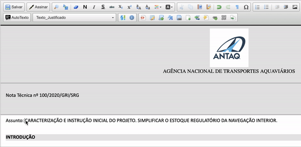

# [](../) |  SEI Pro 

##  Primeira letra maiúscula (exceto artigos e preposições)

Essa funcionalidade adiciona ao editor de texto do SEI a conversão da primeira letra do texto selecionado em letra maiúscula, exceto para os artigos e preposições.

>  

Atualmente são excetuados os seguintes artigos e preposições:

``` "a", "à", "algo", "alguém", "algum", "alguma", "algumas", "alguns", "ao", "aos", "aquela", "aquelas", "aquele", "aqueles", "aquilo", "as", "às", "cada", "certa", "certas", "certo", "certos", "com", "comigo", "como", "conosco", "consigo", "contigo", "convosco", "cuja", "cujas", "cujo", "cujos", "da", "das", "de", "dessa", "dessas", "desse", "desses", "desta", "destas", "do", "dos", "dum", "duma", "dumas", "duns", "e", "é", "ela", "elas", "ele", "eles", "em", "entre", "essa", "essas", "esse", "esses", "esta", "estas", "este", "estes", "eu", "isso", "isto", "la", "las", "lhe", "lhes", "lo", "los", "me", "mesma", "mesmas", "mesmo", "mesmos", "meu", "meus", "mim", "minha", "minhas", "muita", "muitas", "muito", "muitos", "na", "nada", "não", "nas", "nenhum", "nenhuma", "nenhumas", "nenhuns", "ninguém", "no", "nos", "nós", "nossa", "nossas", "nosso", "nossos", "num", "numa", "numas", "nuns", "o", "onde", "os", "ou", "outra", "outras", "outrem", "outro", "outros", "para", "pela", "pelas", "pelo", "por", "pouca", "poucas", "pouco", "poucos", "quais", "quaisquer", "qual", "qualquer", "quando", "quanta", "quantas", "quanto", "quantos", "que", "quem", "são", "se", "seja", "sem", "seu", "seus", "si", "sob", "sobre", "sua", "suas", "tanta", "tantas", "tanto", "tantos", "te", "teu", "teus", "ti", "toda", "todas", "todo", "todos", "tu", "tua", "tuas", "tudo", "um", "uma", "umas", "uns", "vária", "várias", "vário", "vários", "você", "vocês", "vos", "vós", "vossa", "vossas", "vosso", "vossos" ```

## Próximo passo

> [Inserir referência de documentos do processo](./REFDOCUMENTOS.md)
