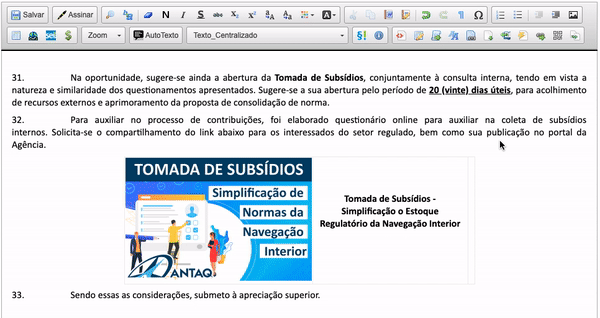

##  Adicionar Link Curto

Essa funcionalidade adiciona ao editor de texto do SEI a geração de link curto através do serviço [TinyURL](https://tinyurl.com/)

TinyURL é um serviço web que transforma links longos em links curtos, tornando-o mais fácil de lembrar e apresentar.

>  

Você ainda pode adicionar um nome personalisado para o link (pode conter apenas letras, números ou travessões)
