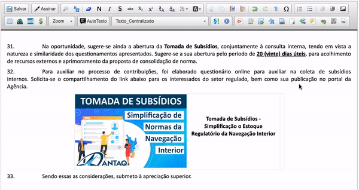

#  |  SEI Pro 

##  Gerar link curto do TinyURL

Links muito longos atrapalham a leitura e quebram na impressão. Esta função **encurta o endereço** pelo serviço [TinyURL](https://tinyurl.com/) e insere o link curto no documento — por exemplo, `https://tinyurl.com/edital-2026`.

> 

### Como usar

1. No editor, clique onde o link deve entrar;
2. Clique no botão **Gerar link curto do TinyURL**;
3. Cole o endereço em **Insira o link que deseja encurtar**;
4. Se quiser, informe um **nome personalizado** (apenas letras, números e travessões);
5. Clique em **Inserir**.

### Como ativar

O botão aparece sempre no editor do SEI quando o SEI Pro está instalado.

### Bom saber

* O encurtamento é feito pelo **TinyURL, um serviço externo**: o endereço original é enviado a ele. Não encurte links que contenham informações restritas.
* Se o nome personalizado já estiver em uso por outra pessoa, escolha outro.
* O link curto é permanente e redireciona para o endereço original enquanto o serviço existir.
* Links curtos combinam com o [QR Code](../pages/QRCODE.md), que também oferece encurtar o endereço antes de gerar o código.

## Próximo item

> [Inserir caixa de seleção (checklist)](../pages/CAIXASELECAO.md)
