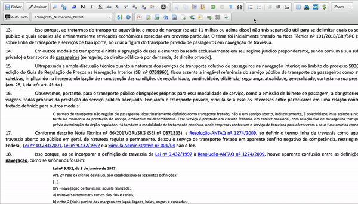

##  Adicionar link de legislação federal

Essa funcionalidade adiciona ao editor de texto do SEI a inclusão de link de legislação federal

>  

As citações acompanham o hiperlink para a norma publicada no site do Planalto.

Atualmente estão disponíveis as seguintes legislações: 

|  Legislação Federal  |
| ------------------- | 
|  [Constituição Federal](http://www.planalto.gov.br/ccivil_03/Constituicao/Constituicao.htm) |
|  [Medidas Provisórias](http://www4.planalto.gov.br/legislacao/portal-legis/legislacao-1/medidas-provisorias) |
|  [Leis Ordinárias](http://www4.planalto.gov.br/legislacao/portal-legis/legislacao-1/leis-ordinarias) |
|  [Decretos](http://www4.planalto.gov.br/legislacao/portal-legis/legislacao-1/decretos1) 
|  [Leis Complementares](http://www4.planalto.gov.br/legislacao/portal-legis/legislacao-1/leis-complementares-1) |
|  [Decretos-Leis](http://www4.planalto.gov.br/legislacao/portal-legis/legislacao-1/decretos-leis) |
|  [Códigos](http://www4.planalto.gov.br/legislacao/portal-legis/legislacao-1/codigos-1) |
|  [Estatutos](http://www4.planalto.gov.br/legislacao/portal-legis/legislacao-1/estatutos) |

### Norma Infralegal

Atualmente estão disponíveis os seguintes normativos infralegais:

|  Norma Infralegal  |
| ------------------- | 
|  [Resolução Normativa ANTAQ](http://sophia.antaq.gov.br/terminal/) |
|  [Resolução ANTAQ](http://sophia.antaq.gov.br/terminal/) |
|  [Súmula Administrativa ANTAQ](http://sophia.antaq.gov.br/terminal/) |
|  [Portaria ANTAQ](http://sophia.antaq.gov.br/terminal/) |
|  [Instrução Normativa ANTAQ](http://sophia.antaq.gov.br/terminal/) |

Deseja adicionar as normas infralegais de outros órgãos? Colabore conosco ([pedrohsoares.adv@gmail.com](mailto:pedrohsoares.adv@gmail.com))

### Lista de Normas

Algumas normas jurídicas de grande relevância são conhecidas pelo seu nome próprio, como o Código Civil (Lei 10.406, de 2002).

Estão disponíveis as seguintes referências nominais:

| Referência nominal  |  Exemplo  |
| ------------------- | ------------------- |
|  `@CF` |  [Constituição Federal](http://www.planalto.gov.br/ccivil_03/constituicao/constituicao.htm) |
|  `@CC` |  [Código Civil](http://www.planalto.gov.br/ccivil_03/leis/2002/L10406.htm) |
|  `@CCm` |  [Código Comercial](http://www.planalto.gov.br/ccivil_03/Leis/LIM/LIM556.htm) |
|  `@CodigoAguas` |  [Código de Águas](http://www.planalto.gov.br/ccivil_03/decreto/D24643.htm) |
|  `@CP` |  [Código Penal](http://www.planalto.gov.br/CCIVIL_03/Decreto-Lei/Del2848.htm) |
|  `@CPP` |  [Código de Processo Penal](http://www.planalto.gov.br/ccivil_03/Decreto-Lei/Del3689.htm) |
|  `@CLT` |  [Consolidação das Leis do Trabalho](http://www.planalto.gov.br/ccivil_03/Decreto-Lei/Del5452.htm) |
|  `@CBT` |  [Código Brasileiro de Telecomunicações](http://www.planalto.gov.br/ccivil_03/Leis/L4117.htm) |
|  `@EstatutoTerra` |  [Estatuto da Terra](http://www.planalto.gov.br/ccivil_03/Leis/L4504.htm) |
|  `@CodigoEleitoral` |  [Código Eleitoral](http://www.planalto.gov.br/ccivil_03/Leis/L4737.htm) |
|  `@CTN` |  [Código Tributário Nacional](http://www.planalto.gov.br/ccivil_03/Leis/L5172.htm) |
|  `@CodigoMinas` |  [Código de Minas](http://www.planalto.gov.br/ccivil_03/Decreto-Lei/Del0227.htm) |
|  `@CPPM` |  [Código de Processo Penal Militar](http://www.planalto.gov.br/ccivil_03/Decreto-Lei/Del1002.htm) |
|  `@CPM` |  [Código Penal Militar](http://www.planalto.gov.br/ccivil_03/Decreto-Lei/Del1001.htm) |
|  `@CPC` |  [Código de Processo Civil](http://www.planalto.gov.br/ccivil_03/Leis/L5869.htm) |
|  `@EstatutoIndio` |  [Estatuto do Índio](http://www.planalto.gov.br/ccivil_03/Leis/L6001.htm) |
|  `@EstatutoMilitares` |  [Estatuto dos Militares](http://www.planalto.gov.br/ccivil_03/Leis/L6880.htm) |
|  `@CBA` |  [Código Brasileiro de Aeronáutica](http://www.planalto.gov.br/ccivil_03/Leis/L7565.htm) |
|  `@ECA` |  [Estatuto da Criança e do Adolescente](http://www.planalto.gov.br/ccivil_03/Leis/L8069.htm) |
|  `@CDC` |  [Código de Defesa do Consumidor](http://www.planalto.gov.br/ccivil_03/Leis/L8078.htm) |
|  `@EstatutoOAB` |  [Estatuto da Advocacia e da Ordem dos Advogados do Brasil (OAB)](http://www.planalto.gov.br/ccivil_03/Leis/L8906.htm) |
|  `@EstatutoRefugiados` |  [Estatuto dos Refugiados](http://www.planalto.gov.br/ccivil_03/Leis/L9474.htm) |
|  `@CTB` |  [Código de Trânsito Brasileiro](http://www.planalto.gov.br/ccivil_03/Leis/L9503.htm) |
|  `@EstatutoCidade` |  [Estatuto da Cidade](http://www.planalto.gov.br/ccivil_03/Leis/LEIS_2001/L10257.htm) |
|  `@EstatutoTorcedor` |  [Estatuto de Defesa do Torcedor](http://www.planalto.gov.br/ccivil_03/Leis/2003/L10.671.htm) |
|  `@EstatutoIdoso` |  [Estatuto do Idoso](http://www.planalto.gov.br/ccivil_03/Leis/2003/L10.741.htm) |
|  `@EstatutoDesarmamento` |  [Estatuto do Desarmamento](http://www.planalto.gov.br/ccivil_03/Leis/2003/L10.826.htm) |
|  `@EstatutoMicroempresas` |  [Estatuto Nacional da Microempresa e da Empresa de Pequeno Porte](http://www.planalto.gov.br/ccivil_03/Leis/LCP/Lcp123.htm) |
|  `@EstatutoMuseus` |  [Estatuto dos Museus](http://www.planalto.gov.br/ccivil_03/_Ato2007-2010/2009/Lei/L11904.htm) |
|  `@EstatutoIgualdadeRacial` |  [Estatuto da Igualdade Racial](http://www.planalto.gov.br/ccivil_03/_Ato2007-2010/2010/Lei/L12288.htm) |
|  `@CFlorestal` |  [Código Florestal](http://www.planalto.gov.br/ccivil_03/_Ato2011-2014/2012/Lei/L12651.htm) |
|  `@EstatutoJuventude` |  [Estatuto da Juventude](http://www.planalto.gov.br/CCIVIL_03/_Ato2011-2014/2013/Lei/L12852.htm) |
|  `@CPC` |  [Código de Processo Civil](http://www.planalto.gov.br/ccivil_03/_ato2015-2018/2015/lei/L13105.htm) |
|  `@EstatutoPCD` |  [Estatuto da Pessoa com Deficiência](http://www.planalto.gov.br/CCIVIL_03/_Ato2015-2018/2015/Lei/L13146.htm) |
