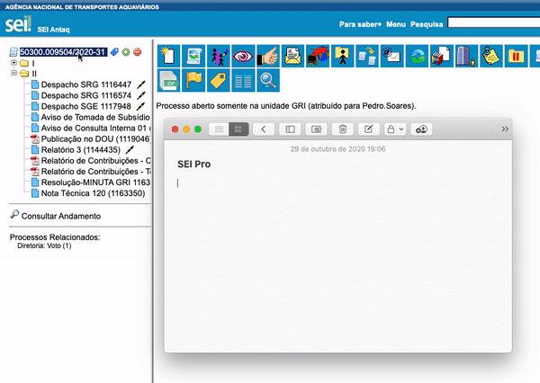
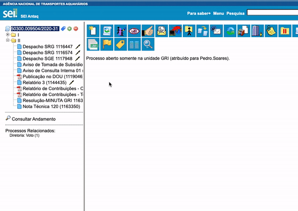

#  |  SEI Pro 

##  Copiar número e nome do documento ou processo

Essa funcionalidade adiciona à arvore de documentos do SEI um menu rápido de opções para o processo

>  

Adicione novos botões e escolha a sua ordem com a opção de **Personalizar Menu**

>  

Além do menu do processo, os documentos também contam com um menu rápido para **Copiar número do documento SEI**, **Nome do Documento** ou o **Link do documento** (sem chave de acesso "hash")

>  
