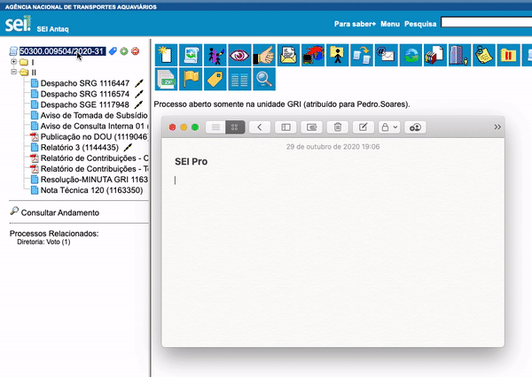
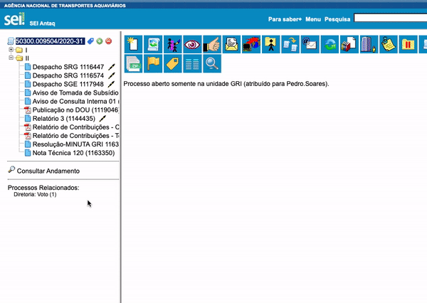
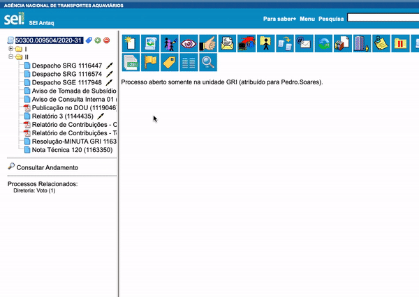

#  |  SEI Pro 

##  Menu e ícones rápidos na árvore do processo

Na árvore do processo, o SEI Pro coloca **atalhos para as ações mais usadas** bem onde você já está olhando: um menu que aparece ao passar o mouse sobre o processo ou sobre um documento, e pequenos ícones ao lado de cada documento — para copiar o número SEI, copiar o link, duplicar e outras ações, sem precisar abrir o documento e procurar o botão.

> 

### Menu rápido do processo

Passe o mouse sobre o **número do processo**, no alto da árvore. Aparece um menu com atalhos para as ações do processo. De fábrica, ele traz:

* Incluir Documento;
* Consultar/Alterar Processo;
* Enviar Documento Externo;
* Atribuir Processo;
* Adicionar/Remover Urgência (veja [Destacar processos urgentes](../pages/URGENTE.md)).

Qualquer ação da barra de botões do processo pode ser incluída no menu.

### Menu rápido dos documentos

Passe o mouse sobre o **ícone de um documento** na árvore. De fábrica, o menu traz **Copiar número SEI**, **Copiar nome do documento** e **Copiar link do documento** (o link permanente, sem a chave de acesso temporária).

> 

Outras ações disponíveis para esse menu: Duplicar documento, Copiar para..., Imprimir Web, Visualizar em nova aba, Baixar documento, Consultar documento, Incluir em bloco, Cancelar documento, Versões do documento, Gerar circular e Assinatura externa.

Se o menu atrapalhar ao passar o mouse, marque **Ativar menu ao clicar**: ele passa a abrir só com um clique.

### Ícones rápidos na árvore

Ao lado de cada documento aparecem pequenos ícones de um clique. De fábrica: **Copiar número SEI**, **Copiar link do documento** e **Duplicar documento** (veja [Duplicar documentos com 1 clique](../pages/DUPLICARDOC.md)).

Também podem ser escolhidos: Copiar nome do documento, Copiar número com link, Copiar nome com link, Copiar para... e Visualizar em nova aba. Os itens "com link" copiam o texto já com o hiperlink, pronto para colar num documento do SEI.

### Personalizar

1. No menu rápido do processo, clique em **Personalizar Menu** (último item, em cinza);
2. A janela tem uma aba para cada parte: **Processo**, **Documentos**, **Árvore** e **Painel**;
3. Ligue ou desligue cada item e **arraste para mudar a ordem**;
4. Em cada aba é possível desativar o bloco inteiro — por exemplo, ficar só com os ícones da árvore, sem os menus.

> 

A aba **Painel** controla quais informações aparecem abaixo da árvore — veja [Informações adicionais na árvore do processo](../pages/INFOARVORE.md).

### Como ativar

A função vem **ligada** de fábrica. Ela fica nas [Configurações do SEI Pro](../pages/DESATIVARFUNCOES.md), aba **Geral**, seção **Controle de Processos**, opção **Menu rápido na árvore de documentos**.

### Bom saber

* A personalização fica guardada **neste navegador**.
* Os atalhos só fazem o que o SEI já permite: se você não tem permissão para uma ação, ela não aparece na barra do processo e também não aparece no menu.

## Próximo item

> [Duplicar documentos com 1 clique](../pages/DUPLICARDOC.md)
