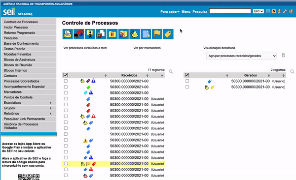

#  |  SEI Pro 

##  Menu Suspenso

Essa funcionalidade torna o menu lateral do SEI suspenso na tela, otimizando o espaço útil da sua área de trabalho.

>   

Por padrão, o **Menu Suspenso** vem desativado. Após instalar o SEI Pro, ative-o nas configurações da extensão:

Clique no ícone do **SEI Pro** na barra de extensões do Google Chrome:

>  

Caso o ícone não esteja visível, fixe-o na barra de extensões.

>  

Ou cole o link na barra de endereços do navegador:

> `chrome-extension://cnkocjlifhcemdapiomhehhmjmlmmgem/html/options.html`

## Próximo item

> [Filtrar e Ordernar tabelas ao clicar no seu cabeçalho](../pages/ORDERNARTABELA.md)
