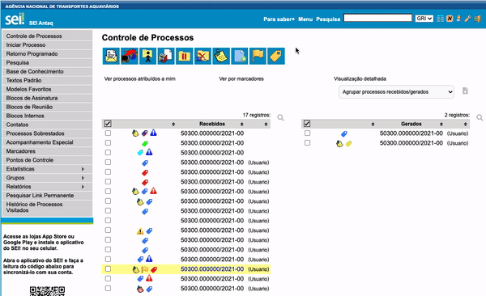

#  |  SEI Pro 

##  Menu Suspenso

O menu lateral do SEI ocupa uma faixa fixa da tela, mesmo quando você não está usando. Com o **Menu Suspenso**, ele fica **escondido e aparece por cima do conteúdo** só quando você precisa — as tabelas e documentos ganham a largura inteira da janela.

> 

### Como usar

1. Clique no ícone de menu (☰), ao lado do logotipo do SEI, para abrir o menu;
2. Escolha a opção desejada;
3. Clique de novo no ícone, ou fora do menu, para escondê-lo.

O SEI Pro lembra se você deixou o menu aberto ou fechado e mantém a escolha nas próximas telas.

### Como ativar

A função vem **desligada** de fábrica. Para ligar, abra as [Configurações do SEI Pro](../pages/DESATIVARFUNCOES.md), aba **Geral**, seção **Controle de Processos**, e marque **Menu Suspenso**. Clique em **Salvar** e recarregue o SEI.

### Bom saber

* No SEI 4 e 5, que já permitem recolher o menu, a função reaproveita o botão do próprio SEI e esconde o ícone nativo de exibir/ocultar menu, para não haver dois botões fazendo a mesma coisa.
* Veja também [Ordenar itens do menu](../pages/ORDERNARMENU.md), para deixar as opções que você mais usa no topo.

## Próximo item

> [Ordenar itens do menu](../pages/ORDERNARMENU.md)
