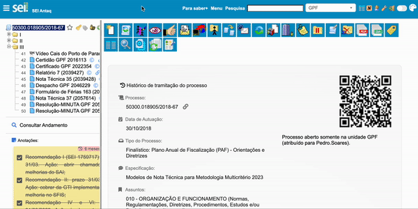

#  |  SEI Pro 

##  Mover ícone de excluir documentos para o final da lista

Essa funcionalidade move ícone de excluir documentos para o final da lista de ícones da tela de visualização de documentos.

Devido a proximidade entre os botões de **Concluir Processo** e **Excluir Documento**, a funcionalidade previne encerramentos equivocados de processos.

> 

## Próximo item

> [.](../pages/.md)

