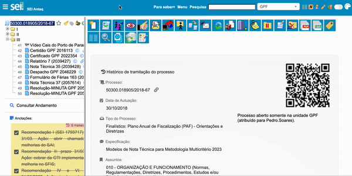

#  |  SEI Pro 

##  Mover ícone de excluir documentos para o final da lista

No SEI 3, o botão **Excluir** do documento fica colado a outros botões muito usados, e é fácil clicar nele sem querer. Esta função **leva o botão Excluir para o fim da barra de botões** do documento, longe dos demais.

> 

### Como ativar

A função vem **ligada** de fábrica. Ela fica nas [Configurações do SEI Pro](../pages/DESATIVARFUNCOES.md), aba **Geral**, seção **Árvore e Visualização de Documentos**, opção **Mover ícone de excluir documentos para o final da lista**.

### Bom saber

* A função vale para o **SEI 3**. No SEI 4 e 5, que reorganizaram a barra de botões, ela não altera nada.
* Só muda a posição do botão: excluir continua pedindo a confirmação do SEI.

## Próximo item

> [Inserir conteúdo externo (Word, HTML e Google Docs)](../pages/INSERIRDOC.md)
