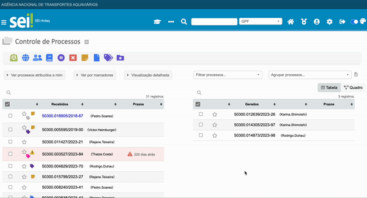

#  |  SEI Pro 

##  Permitir marcar processos como "Não Visualizado"

Essa funcionalidade permitir marcar processos como "Não Visualizado", a partir da tela inicial do SEI.

> 

Atenção: A ferramenta apenas automatiza o processo de envio para sua própria unidade, permitindo assim que seja marcado novamente o processo como "Não Visualizado"

Ao executar essa ação, é adicionada ao andamento do processo a informação "Processo marcado como não visualizado".

## Próximo item

> [.](../pages/.md)

