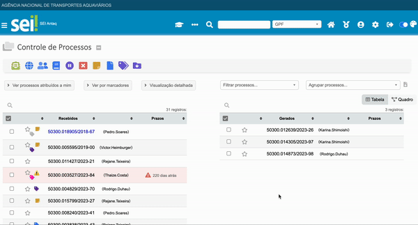

#  |  SEI Pro 

##  Permitir marcar processos como "Não Visualizado"

Abriu um processo sem querer, ou quer lembrar de voltar a ele depois? No SEI, uma vez aberto, o processo deixa de aparecer em vermelho e não há como desfazer. Com esta função, você **marca o processo como não visualizado de novo**, direto da tela Controle de Processos.

> 

### Como usar

1. Na tela **Controle de Processos**, marque a caixa de seleção de um ou mais processos;
2. Na barra de ações, clique no ícone **Marcar como não visualizado** (olho cortado);
3. Aguarde: os processos são tratados um de cada vez e voltam a aparecer em vermelho.

### Como funciona

O SEI não tem um botão de "marcar como não lido". O SEI Pro **automatiza o caminho que já existe**: registra no andamento do processo o texto *"Processo marcado como não visualizado"* e **envia o processo para a sua própria unidade** — ou seja, ele não sai de onde está. Todo processo que chega à unidade aparece como não visualizado — é esse o efeito aproveitado.

### Como ativar

A função vem **ligada** de fábrica. Ela fica nas [Configurações do SEI Pro](../pages/DESATIVARFUNCOES.md), aba **Geral**, seção **Controle de Processos**, opção **Permitir marcar processos como "Não Visualizado"**.

### Bom saber

* A ação **fica registrada no andamento** do processo (a atualização de andamento e o envio para a própria unidade) e pode ser vista por qualquer pessoa que consulte o histórico.
* O processo passa a aparecer como não visualizado **para todos da unidade**, não só para você.
* Na lista, processos não visualizados ganham o prefixo **(Não Visualizado)** no texto que aparece ao passar o mouse, o que ajuda a identificá-los mesmo sem a cor.

## Próximo item

> [Exportar informações de processos em planilha CSV](../pages/LISTAPROCESSOS.md)
