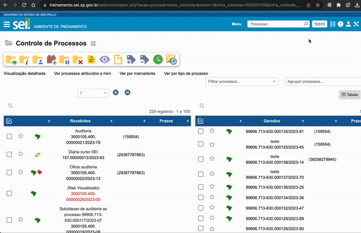

#  |  SEI Pro 

##  Mostrar nomes de usuários na tabela de controle de processos

Essa funcionalidade permite mostrar nomes de usuários na tabela de controle de processos.

> 

## Próximo item

> [.](../pages/.md)
