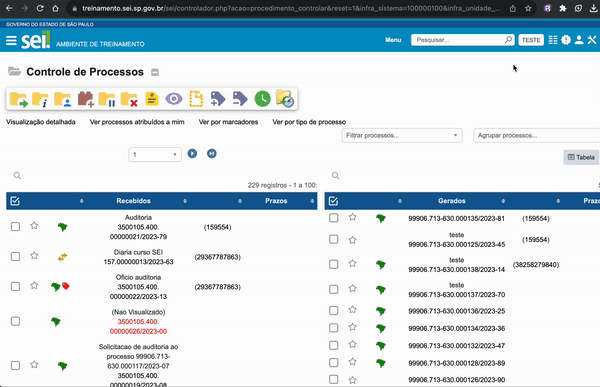

#  |  SEI Pro 

##  Mostrar nomes de usuários na tabela de controle de processos

Quando um processo está atribuído a alguém, o SEI mostra ao lado dele apenas o **login** da pessoa — por exemplo, `(pedro.soares)`. Esta função troca o login pelo **nome da pessoa** (primeiro e último nome), o que ajuda quando os logins são códigos ou matrículas.

> 

### Como ativar

A função vem **desligada** de fábrica. Para ligar, abra as [Configurações do SEI Pro](../pages/DESATIVARFUNCOES.md), aba **Geral**, seção **Controle de Processos**, e marque **Mostrar nomes de usuários na tabela de controle de processos**. Clique em **Salvar** e recarregue o SEI.

### Bom saber

* O nome vem do próprio SEI (o mesmo que aparece ao passar o mouse sobre o login). Nomes compostos são encurtados para primeiro e último nome.
* O quadro do [agrupamento por responsável](../pages/AGRUPAR.md) também passa a mostrar os nomes.
* É só uma mudança de exibição: nada é alterado no SEI.

## Próximo item

> [Contador de processos não visualizados no ícone do SEI](../pages/CONTADORPROCESSOICONE.md)
