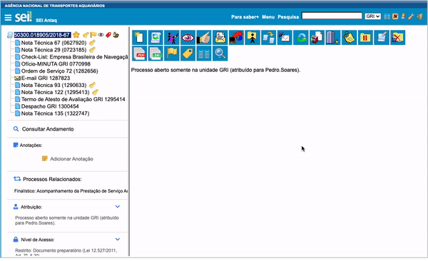

#  |  SEI Pro 

##  Anotação diretamente pela árvore do processo

Essa funcionalidade adiciona à árvore do processo a capacidade de criar anotação diretamente pela árvore do processo.

>   

É possível adicionar uma data de referência à anotação, bem como sinalizar sua prioridade.

## Próximo item

> [Desativar funções da extensão](../pages/DESATIVARFUNCOES.md)
