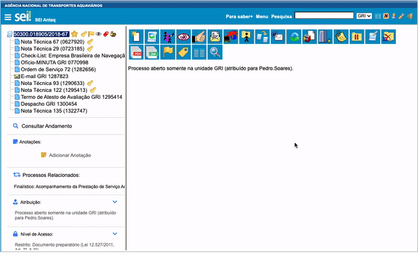

#  |  SEI Pro 

##  Anotação diretamente pela árvore do processo

A **anotação** do SEI é um lembrete da unidade sobre o processo — mas, para ler ou escrever, é preciso abrir a tela de anotações. Com o SEI Pro, a anotação aparece **como um bilhete amarelo logo abaixo da árvore**, e você escreve, altera ou apaga ali mesmo.

> 

### Como usar

* **Escrever ou alterar:** clique no ícone de lápis do bilhete, digite e clique em **Salvar Anotação**. Para desistir, **Cancelar Edição**;
* **Marcar como prioritária:** clique no ícone **!** — o SEI destaca processos com anotação prioritária na tela Controle de Processos;
* **Inserir uma data:** clique no ícone de calendário para acrescentar ao texto uma data de referência (útil para lembrar *até quando* algo deve ser feito);
* **Apagar:** clique na lixeira.

O bilhete mostra quem escreveu a anotação e quando.

### Como ativar

O bilhete faz parte das [Informações adicionais na árvore do processo](../pages/INFOARVORE.md): ele aparece quando essa opção está ligada (vem ligada de fábrica) e o item **Anotações** está marcado em **Personalizar Menu › Painel**.

### Bom saber

* É a **mesma anotação do SEI**: tudo o que você escreve pelo bilhete aparece na tela de anotações e na tela Controle de Processos, para todos da unidade, com ou sem o SEI Pro.
* A anotação é da unidade, não do usuário.

## Próximo item

> [Menu e ícones rápidos na árvore do processo](../pages/MENURAPIDO.md)
