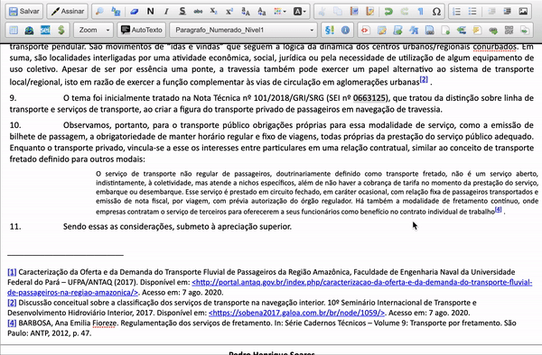
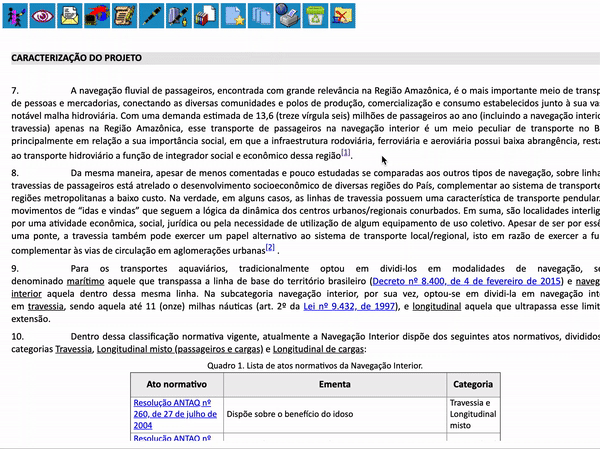

##  Inserir nota de rodapé

Essa funcionalidade adiciona ao editor de texto do SEI a inclusão de notas ao rodapé do documento.

>  

A nota é inserida ao final do corpo do texto principal, enumerada automaticamente e com o link para sua referência no texto.

>  
