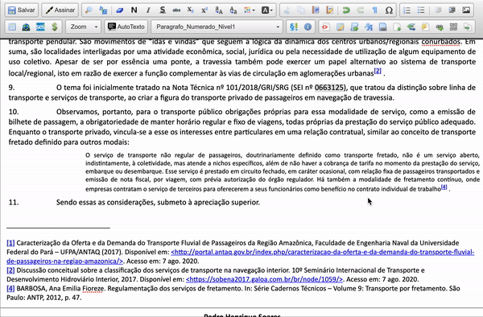
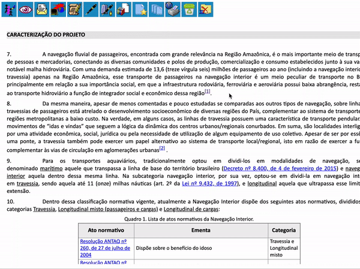

#  |  SEI Pro 

##  Inserir nota de rodapé

O editor do SEI não tem notas de rodapé. Com o SEI Pro, você insere a nota **no ponto do texto**, e ela é **numerada automaticamente** e colocada no **final do documento**, com links nos dois sentidos: do número no texto para a nota, e da nota de volta ao texto.

> 

### Como usar

1. No editor, clique logo depois da palavra ou frase que receberá a nota;
2. Clique no botão **Inserir nota de rodapé**;
3. Escolha uma das abas e clique em **Inserir**:

| Aba | Para que serve |
| --- | -------------- |
| **Texto livre** | Escrever a nota como quiser |
| **Padrão ABNT** | Montar a referência bibliográfica a partir de campos, com pré-visualização |
| **Atualizar notas** | Renumerar e reordenar as notas já existentes |
| **Remover notas** | Apagar todas as notas do documento |

> 

### Referência no padrão ABNT

Na aba **Padrão ABNT**, preencha os campos que tiver — **sobrenome** e **nome do autor**, **título**, **número da edição**, **local**, **editora**, **ano**, **volume**, **páginas**, **link** e **data do acesso** — e acompanhe a referência sendo montada no quadro de pré-visualização.

### Como ativar

O botão aparece sempre no editor do SEI quando o SEI Pro está instalado.

### Bom saber

* Se você **apagar ou mover** trechos com notas, abra a aba **Atualizar notas** e clique em **Atualizar**: a numeração e a ordem são refeitas.
* No documento publicado, as notas aparecem ao final do texto, antes das assinaturas — não no rodapé de cada página impressa.

## Próximo item

> [Adicionar referências internas](../pages/REFERENCIAINTERNA.md)
