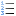
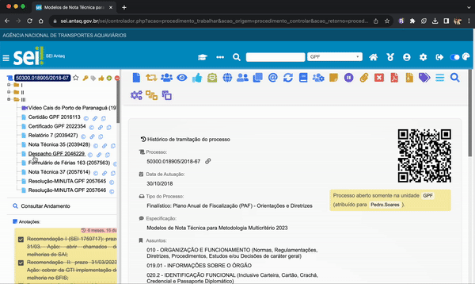

#  |  SEI Pro 

##  Numerar documentos na árvore do processo

Essa funcionalidade adiciona a árvore de documento do processo a visualização de numeração ordinária de documentos, conforme sua posição.

> 

## Próximo item

> [.](../pages/.md)

