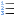
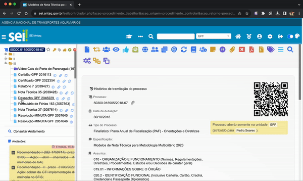

#  |  SEI Pro 

##  Numerar documentos na árvore do processo

Mostra, antes de cada documento da árvore, o **número de ordem** dele no processo — 1, 2, 3... É útil para citar "o documento 15 do processo", conferir a sequência numa análise ou encontrar rapidamente um documento numa árvore longa.

> 

### Como ativar

A função vem **desligada** de fábrica. Para ligar, abra as [Configurações do SEI Pro](../pages/DESATIVARFUNCOES.md), aba **Geral**, seção **Árvore e Visualização de Documentos**, e marque **Numerar documentos na árvore do processo**. Clique em **Salvar** e recarregue o processo.

### Bom saber

* A numeração segue **a ordem em que os documentos aparecem na árvore**. Se a ordem da árvore for alterada, a numeração muda junto.
* Em processos grandes, que o SEI divide em **pastas**, a contagem continua de uma pasta para a outra — o primeiro documento da segunda pasta não recomeça do 1.
* É só uma numeração de exibição: não aparece para quem não usa o SEI Pro, nem nos documentos gerados.
* Para citar documentos por número em um texto, veja [campos dinâmicos](../pages/DADOSPROCESSO.md) como `#documento5`.

## Próximo item

> [Dividir as informações do documento na árvore em duas linhas](../pages/DIVIDIRLINHASARVORE.md)
