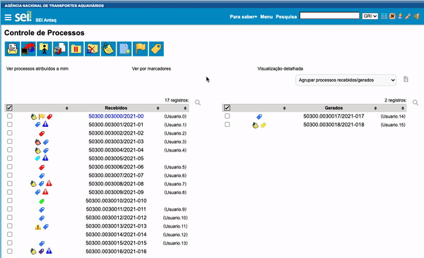

#  |  SEI Pro 

##  Ordenar e filtrar tabelas ao clicar no cabeçalho

Em quase todas as tabelas do SEI — Controle de Processos, blocos, acompanhamento especial, marcadores, estatísticas — o SEI Pro permite **ordenar as linhas clicando no título da coluna** e **filtrar** o conteúdo digitando.

> 

### Ordenar

* Clique no **título da coluna** para ordenar em ordem crescente; clique de novo para a ordem decrescente;
* Colunas de **datas** são ordenadas como datas (e não como texto).

### Filtrar

1. Clique no ícone de **lupa** (**Pesquisar na tabela**), acima da tabela;
2. Aparece uma linha de campos sob os títulos das colunas;
3. Digite no campo da coluna desejada: a tabela mostra só as linhas que combinam.

Na tela Controle de Processos, a busca também procura dentro das **anotações** e dos **marcadores** dos processos.

### Como ativar

A função vem **ligada** de fábrica. Ela fica nas [Configurações do SEI Pro](../pages/DESATIVARFUNCOES.md), aba **Geral**, seção **Controle de Processos**, opção **Ordenar tabelas ao clicar no seu cabeçalho**.

### Bom saber

* **A ordenação e os filtros ficam gravados**: ao voltar à tela, a tabela aparece como você deixou. Para ver tudo de novo, limpe os campos de filtro.
* Com a paginação do SEI ligada, ordenação e filtro valem só para a página atual. Veja [Remover paginação](../pages/REMOVEPAGINACAO.md).
* Para agrupar e filtrar por marcador, tipo ou responsável, veja também [Agrupar lista de processos](../pages/AGRUPAR.md).

## Próximo item

> [Mostrar especificação do processo na tabela](../pages/ESPECIFICACAOPROCESSO.md)
