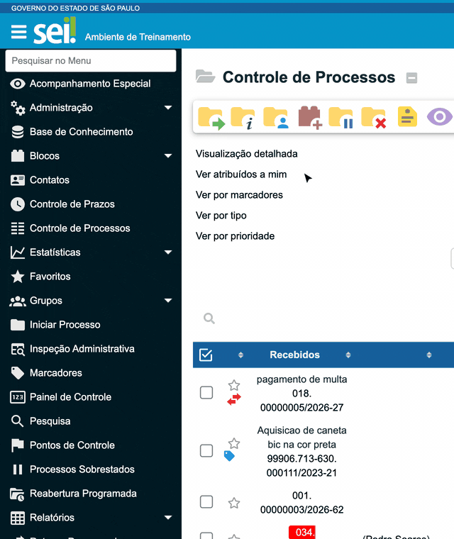

#  |  SEI Pro 

##  Ordenar itens do menu

O menu lateral do SEI mostra as opções sempre na mesma ordem, e as que você mais usa podem estar lá embaixo. Com esta função, **você arrasta os itens do menu para a posição que preferir**, e a nova ordem fica gravada.

> 

### Como usar

1. No menu lateral do SEI, clique sobre um item e **segure o botão do mouse**;
2. Arraste o item para cima ou para baixo, até a posição desejada;
3. Solte o botão. A ordem é salva na hora.

Pronto: nas próximas vezes em que abrir o SEI, o menu aparece na ordem que você definiu.

### Como ativar

A função vem **ligada** de fábrica. Ela fica nas [Configurações do SEI Pro](../pages/DESATIVARFUNCOES.md), aba **Geral**, seção **Controle de Processos**, opção **Ordenar Itens do Menu**.

### Bom saber

* São movidos os **itens principais** do menu. Os submenus (como os de **Administração** ou **Relatórios**) acompanham o item de cima.
* A ordem fica guardada **neste navegador**. Em outro computador, o menu aparece na ordem original do SEI.
* Para voltar à ordem original, arraste os itens de volta ou desligue a função.
* Se você arrastar sem querer ao tentar clicar, basta clicar sem mover o mouse: o clique curto continua abrindo a opção normalmente.

## Próximo item

> [Caixas de seleção inteligentes e troca rápida de unidade](../pages/SUBSTITUIRSELECAO.md)
