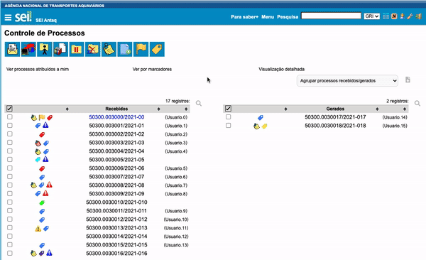

#  |  SEI Pro 

##  Filtrar e ordenar tabelas ao clicar no seu cabeçalho

Essa funcionalidade adiciona ao SEI a possibilidade de ordenar as tabelas de dados ao clicar no seu cabeçalho, bem como filtrar o seu conteúdo.

>   

A pesquisa dos filtros buscam dentro das anotações e marcadores dos processos também. O resultado do filtro permanece gravado caso a página seja recarregada.

A funcionalidade de **filtrar e ordenar** está disponível em todas as tabelas de dados do sistema.

## Próximo item

> [Histórico de processos visitados](../pages/HISTORICOPROC.md)
