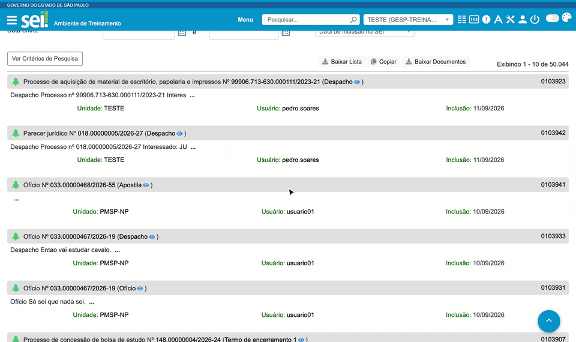

#  |  SEI Pro 

##  Ferramentas na tela de Pesquisa

Na tela **Pesquisa** do SEI, o SEI Pro acrescenta atalhos para aproveitar melhor o resultado: **ver um documento sem sair da lista**, **copiar ou baixar a lista** de resultados em planilha e **baixar de uma vez os documentos** encontrados.

> 

### Visualização rápida

Ao lado de cada documento do resultado aparece um ícone de **olho**. Clique nele para abrir o documento numa janela por cima da lista — sem perder a pesquisa nem abrir outra aba.

Na janela, os botões permitem:

* **Imprimir** o documento;
* **Baixar** o documento;
* **Abrir** o documento no SEI.

O resultado que você acabou de ver fica destacado em amarelo, para não se perder na lista.

### Baixar Lista e Copiar

Acima dos resultados aparecem três botões:

| Botão | O que faz |
| ----- | --------- |
| **Baixar Lista** | Salva os resultados da página numa planilha (`.csv`) |
| **Copiar** | Copia os mesmos dados para colar no Excel, no Word ou num e-mail |
| **Baixar Documentos** | Baixa, um a um, todos os documentos da página de resultados |

A planilha traz o processo (com link), o número SEI, a descrição, a unidade geradora, o usuário e a data. Quando a pesquisa é por **processos**, as colunas de documento são omitidas.

### Como ativar

As ferramentas aparecem sempre que o SEI Pro está instalado — não há opção para ligar ou desligar.

### Bom saber

* Os botões trabalham com **a página de resultados que está na tela** (normalmente 10 itens). Para levar mais itens, avance as páginas e repita, ou refine a pesquisa.
* **Baixar Documentos** pode gerar vários downloads seguidos. Se o navegador perguntar se permite baixar vários arquivos, autorize.
* Um ícone ao lado de cada documento mostra o andamento: baixando, baixado ou erro.
* Veja também [Rolagem infinita na pesquisa de processos](../pages/ROLAGEMINFINITA.md).

## Próximo item

> [Rolagem infinita na pesquisa de processos](../pages/ROLAGEMINFINITA.md)
