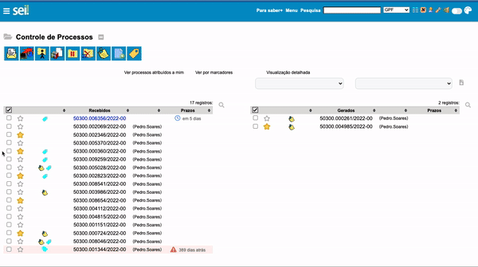
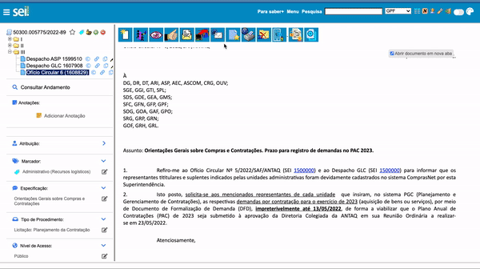

#  |  SEI Pro 

##  Gerenciar Prazos

Essa funcionalidade adiciona à página de controle de processos do SEI a capacidade de gerenciar prazos.

>  

Os prazos (data e hora) ficam gravados dentro das informações dos marcadores. 
Dessa forma, todos os usuários da unidade que utilizarem o **SEI Pro** poderão visualizar e controlar os prazos dos processos.

Ainda, é possível adicionar prazos em lote. Basta selecioná-los e clicar no ícone **"Adicionar prazo"** na barra de ações.

>  

Caso prefira, você poderá gerenciar o prazo do processo dentro dele, através da barra lateral de informações, ao editar as opções de marcadores.

>  

## Próximo item

> [Inserir ...](../pages/PAGE.md)
