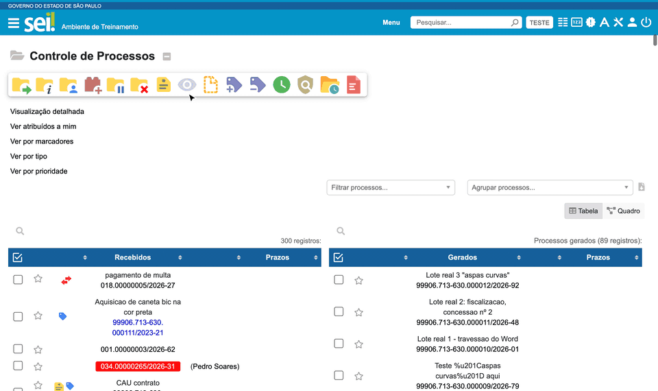
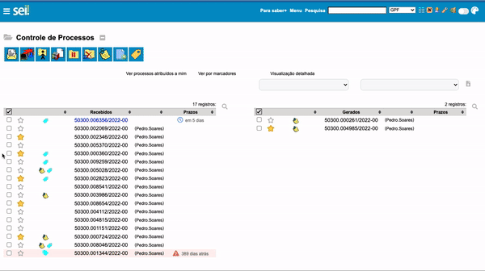
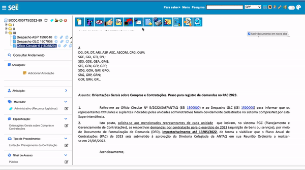

#  |  SEI Pro 

##  Controle de Prazos

Acrescenta à tela **Controle de Processos** uma coluna **Prazos**, que mostra quanto falta para vencer — ou há quanto tempo o processo está parado — em cada processo. Você define o prazo em poucos cliques, para um ou vários processos de uma vez.

> 

### Como adicionar um prazo

1. Na tela **Controle de Processos**, marque a caixa de seleção de um ou mais processos;
2. Na barra de ações, clique no ícone **Adicionar prazo** (relógio azul);
3. Na janela **Controle de prazo em processos**, preencha:

| Campo | O que informar |
| ----- | -------------- |
| **Controlar vencimento?** | Ligado: você informa a **data de vencimento** e a coluna mostra quanto falta ("em 12 dias"). Desligado: você informa uma **data inicial** e a coluna mostra quanto tempo já passou ("há 5 dias") |
| **Data** e **hora** | A data do vencimento ou a data inicial. Sem hora, vale 23:59 |
| **Marcador** | O marcador do SEI em que o prazo será gravado |
| **Texto** | Uma descrição curta, opcional — por exemplo, *Responder ofício* |

4. Clique em **Adicionar Prazo**.

Em alguns segundos a coluna **Prazos** mostra o tempo restante. Clique sobre ele para alterar a data.

Para apagar, abra a mesma janela e clique em **Remover Prazos**.

### Onde o prazo fica gravado

O prazo é escrito **no texto do marcador** do processo, no próprio SEI — por exemplo, *"Até 25/09/2026 23:59 Responder ofício"*. Por isso:

* **todos da unidade que usam o SEI Pro** veem e controlam os mesmos prazos, em qualquer computador;
* quem não usa a extensão vê o marcador com a data escrita no texto;
* se o marcador for retirado do processo, o prazo some junto.

### Também dentro do processo

Na árvore do processo, ao editar o marcador pelo painel de informações ([Informações adicionais na árvore](../pages/INFOARVORE.md)), os mesmos campos de prazo aparecem.

> 

> 

### Como ativar

A função vem **ligada** de fábrica. Ela fica nas [Configurações do SEI Pro](../pages/DESATIVARFUNCOES.md), aba **Geral**, seção **Controle de Processos**, opção **Controlar Prazos**.

### Bom saber

* Para ver os processos na ordem de vencimento, escolha **Agrupar processos por prazo** em [Agrupar lista de processos](../pages/AGRUPAR.md), ou clique no cabeçalho da coluna **Prazos**.
* A contagem é em **dias corridos**.
* Se você digitar à mão uma data no formato `DD/MM/AAAA` no texto de um marcador, o SEI Pro também a reconhece como prazo. Com a palavra **"até"** no texto, ela é tratada como vencimento.
* Na janela **Controle de prazo em processos**, os caracteres do **Texto** que o SEI não aceita, comuns em texto colado do Word, são trocados pelo equivalente simples: o travessão (—) vira hífen (-) e as aspas curvas (“ ”) viram aspas retas ("). Os acentos são mantidos.

## Próximo item

> [Reabertura programada de processos](../pages/REABRIRPROCESSOS.md)
