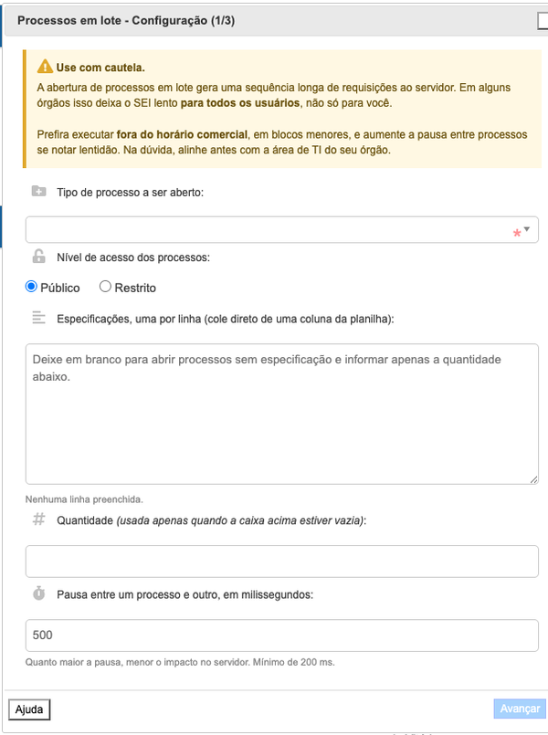

#  |  SEI Pro 

##  Processos em Lote

Essa ferramenta abre vários processos de um mesmo tipo de uma só vez, a partir de uma lista de especificações colada pelo usuário ou de uma quantidade informada.

> 

Serve para quando é preciso abrir dezenas de processos iguais — um por servidor, um por contrato, um por município — e abrir cada um à mão levaria a tarde inteira.

O acesso é feito pelo link **Processos em Lote**, no menu à esquerda do SEI. O link só aparece se a opção correspondente estiver marcada na tela de configurações da extensão.

### ⚠️ Antes de usar

> A abertura de processos em lote gera uma sequência longa de requisições ao servidor. Em alguns órgãos isso deixa o SEI lento **para todos os usuários**, não apenas para quem está executando a ferramenta.
>
> Recomenda-se executá-la **fora do horário comercial**, em blocos menores, aumentando a pausa entre processos caso perceba lentidão. Na dúvida, alinhe previamente com a área de tecnologia do seu órgão.

Os processos são abertos **na unidade que estiver selecionada** no momento da execução.

### Como usar

1. Selecione no SEI a unidade em que os processos devem ser abertos e clique em **Processos em Lote**, no menu à esquerda;

2. Na tela de configuração, informe:

> **Tipo de processo** — o mesmo tipo será usado em todos os processos da rodada;
>
> **Nível de acesso** — Público ou Restrito. Ao escolher Restrito, é obrigatório indicar a hipótese legal, que é carregada a partir do formulário real daquele tipo de processo;
>
> **Especificações** — uma por linha. É possível colar diretamente uma coluna de planilha. Cada linha gera um processo, e o texto é limitado a 100 caracteres, como no formulário do próprio SEI;
>
> **Quantidade** — usada apenas quando a caixa de especificações estiver vazia, para abrir N processos sem especificação;
>
> **Pausa entre um processo e outro** — em milissegundos, com mínimo de 200. Quanto maior a pausa, menor o impacto no servidor.

3. Na tela de confirmação, revise a quantidade, o tipo, o nível de acesso e o tempo estimado. Depois de iniciada, a execução não desfaz os processos já criados;

4. Durante a execução é exibido o progresso, com contagem de falhas e um botão para cancelar. **Não feche a janela nem navegue na aba** enquanto a rodada estiver em andamento;

5. Ao final, é apresentada uma tabela com o número de cada processo criado, a especificação correspondente, um link de acesso e a mensagem de erro das linhas que falharam. A tabela pode ser copiada ou baixada em CSV pelos botões no cabeçalho.

### Observações

> Linhas que falham não interrompem a execução: o erro é registrado na tabela final e a ferramenta segue para a próxima. Assim, basta reprocessar as linhas com erro.
>
> Assuntos e interessados recebem o padrão definido para o tipo de processo escolhido, não sendo possível preenchê-los individualmente por esta ferramenta.
>
> O limite é de 2.000 processos por rodada. Demandas maiores devem ser divididas em blocos.

## Próximo item

> [Ações em Lote](../pages/ACOESEMLOTE.md)
