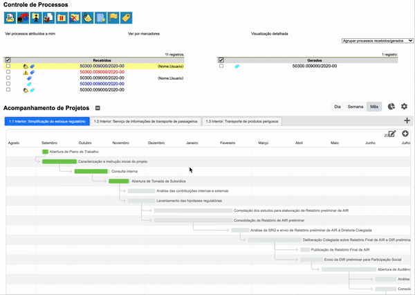

#  |  SEI Pro 

##  Gerenciar projetos

 [MOMENTANEAMENTE DESCONTINUADA] A API do Google utilizada pela ferramenta está descontinuada. Em breve retomaremos o projeto com solução alternativa.

Essa funcionalidade adiciona à página inicial do SEI um gestor de projetos utilizando o [Diagrama de Gantt](https://pt.wikipedia.org/wiki/Diagrama_de_Gantt)

>  

Para que você possa compartilhar seus projetos com sua equipe, utilizamos uma planilha online no Google Spreadsheets como base de dados.

Os passos a seguir são necessários apenas para o proprietário da base de dados. Para os demais usuários, leia o passo **3. Gerenciando seus projetos**

## 1. Criando Base de Dados

Siga o passo a passo para [Configurar o Google Spreadsheets como uma base de dados](../pages/BASEDADOS.md)

## 2. Conectando ao SEI Pro

Siga o passo a passo para [Conectar o SEI Pro ao Google Spreadsheets](../pages/SEISHEETS.md)

## 3. Gerenciando seus projetos

- [Compartilhando seus projetos com outros usuários](../pages/PROJETOSSHARE.md)
- [Carregando chaves de acesso de outro usuário](../pages/PROJETOSIMPORT.md)
- [Criando e editando projetos](../pages/PROJETOSEDIT.md)

## Próximo item

> [Agrupar lista de processos por marcadores, tipo, responsável ou ponto de controle](../pages/AGRUPAR.md)

