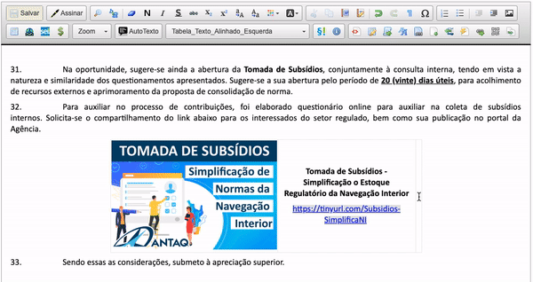
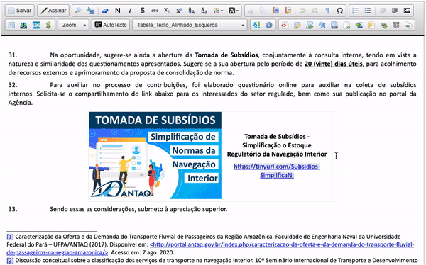

#  |  SEI Pro 

##  Adicionar Código QR (QRCode)

Essa funcionalidade adiciona ao editor de texto do SEI a edição e inclusão de Código QR (QRCode) em seus documentos.

>  

Controle e personalize seu QRCode com as opções avançadas:

>  

## Próximo passo

> [Redimensionar imagens](./pages/REDIMENSIONAIMG.md)
