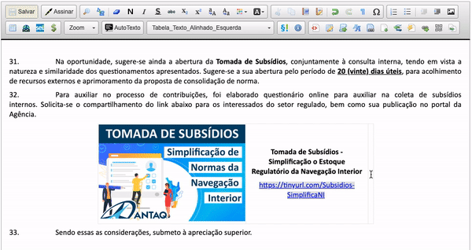
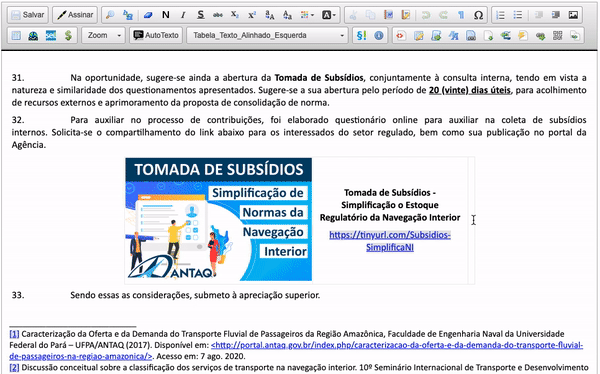

#  |  SEI Pro 

##  Gerar código QR (QR Code)

Coloque um **QR Code** no documento — para um formulário, um edital, um endereço, um contato — e quem estiver com o papel na mão abre o conteúdo apontando a câmera do celular.

> 

### Como usar

1. No editor, clique onde o código deve entrar;
2. Clique no botão **Gerar Código QR**;
3. Em **Insira o texto que deseja codificar**, escreva o endereço (ou qualquer texto). A pré-visualização aparece na hora;
4. Clique em **Inserir**.

### Opções avançadas

Clique em **Opções avançadas** para personalizar:

| Opção | O que ajusta |
| ----- | ------------ |
| **Tamanho do QR** e **Margens de folga** | Tamanho do código e espaço em volta |
| **Nível de correção de erros** | Baixo (7%), Médio (15%) ou Alto (30%). Quanto mais alto, mais o código resiste a manchas e dobras — e mais "denso" fica |
| **Versão** e **Raio de canto** | Densidade dos módulos e cantos arredondados |
| **Cor de Preenchimento** e **Cor de Fundo** | Cores do código (o fundo pode ser transparente) |
| **Modo** | Normal, com **etiqueta** (texto) ou com **imagem** no centro, em caixa ou em faixa |
| **Fonte**, **cor**, **tamanho** e **posição** da etiqueta | Aparência do texto ou imagem central |

**Resetar configurações** volta ao padrão.

> 

### Como ativar

O botão aparece sempre no editor do SEI quando o SEI Pro está instalado.

### Bom saber

* O código é gerado **no seu computador** e entra no documento como imagem.
* **Teste antes de assinar**: aponte a câmera do celular para a tela e confira se abre o endereço certo — principalmente com etiqueta ou imagem no centro, que cobrem parte do código.
* Endereços curtos geram códigos mais simples e fáceis de ler. Veja [Link curto do TinyURL](../pages/LINKCURTO.md).
* Para um QR Code do próprio processo, use o campo dinâmico `#qrcode` em [Dados do processo](../pages/DADOSPROCESSO.md).

## Próximo item

> [Gerar link curto do TinyURL](../pages/LINKCURTO.md)
