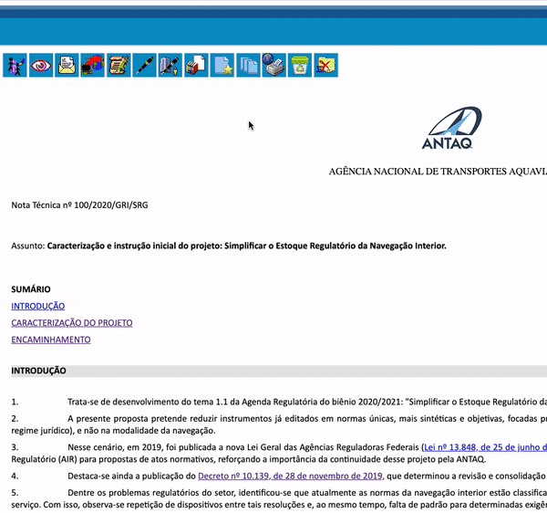
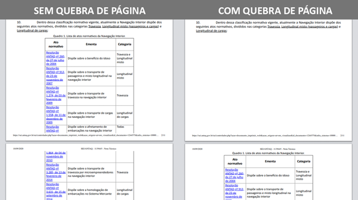

#  |  SEI Pro 

##  Adicionar Quebra de Página

Essa funcionalidade adiciona ao editor de texto do SEI a inserção de quebra de página no documento.

>  

O elemento de quebra de página é invisível ao leitor do documento, sendo identificado pelo navegador apenas ao imprimir um documento:

>  

>  
