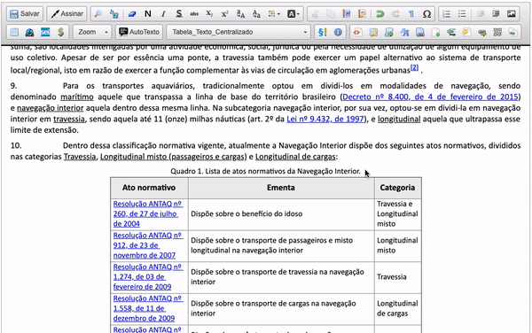
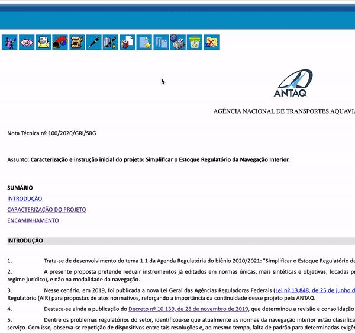
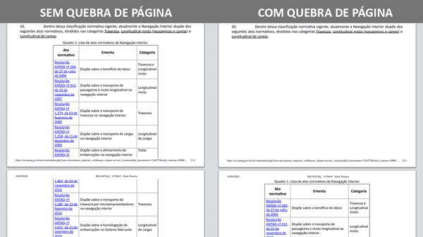

#  |  SEI Pro 

##  Inserir quebra de página

Na impressão (ou no PDF gerado pelo navegador), o texto do SEI corre sem controle de onde cada página termina. A **quebra de página** força o conteúdo seguinte a **começar numa nova folha** — útil para separar anexos, termos e capas.

> 

### Como usar

1. No editor, clique no parágrafo que deve **começar a nova página**;
2. Na barra do editor, clique em **Inserir Quebra de Página**;
3. A quebra é inserida logo antes desse parágrafo.

### Como ativar

O botão aparece sempre no editor do SEI quando o SEI Pro está instalado.

### Bom saber

* A quebra é **invisível na tela**: quem lê o documento no SEI não vê diferença. Ela só aparece ao **imprimir** ou salvar como PDF pelo navegador.

> 

> 

* Para reiniciar a numeração dos parágrafos, a ferramenta é outra: a [quebra de seção](../pages/QUEBRASECAO.md).
* Para definir papel, orientação e margens da impressão, veja [Configurações de página para impressão](../pages/CONFIGIMPRESSAO.md).

## Próximo item

> [Inserir quebra de seção (reiniciar numeração)](../pages/QUEBRASECAO.md)
