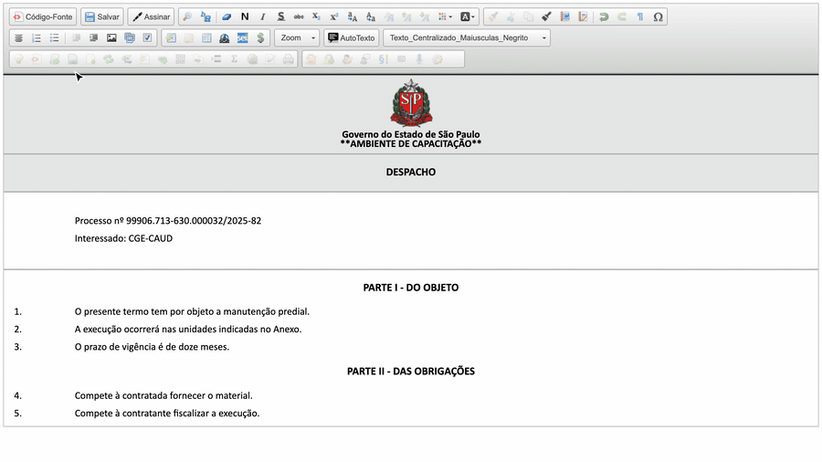

#  |  SEI Pro 

##  Inserir quebra de seção (reiniciar numeração)

Os estilos de parágrafo numerado do SEI contam **do começo ao fim do documento**: se o documento tem duas partes, a segunda continua a numeração da primeira (4, 5, 6...). A **quebra de seção** faz a contagem **recomeçar do 1** a partir do ponto que você escolher.

> 

### Quando usar

* Documentos com **partes independentes** — por exemplo, o termo e o seu anexo, cada um com parágrafos numerados desde o 1;
* Listas de **itens**, **incisos** ou **alíneas** que precisam recomeçar em outro trecho do texto.

### Como usar

1. No editor, clique no parágrafo **a partir do qual** a numeração deve recomeçar (por exemplo, o título da segunda parte);
2. Na barra do editor, clique em **Inserir Quebra de Seção**;
3. A numeração dos parágrafos seguintes volta ao 1.

### O que é reiniciado

A quebra zera, de uma vez, todos os contadores automáticos do SEI: **parágrafos numerados** (níveis 1 a 4), **itens** (níveis 1 a 4), **incisos** (romanos) e **alíneas** (letras).

### Como ativar

O botão aparece sempre no editor do SEI quando o SEI Pro está instalado.

### Bom saber

* A quebra de seção é **invisível** no documento: ela não aparece para quem lê, nem na impressão.
* Para desfazer, use **Desfazer** (`Ctrl + Z`) logo em seguida, ou apague a linha vazia criada antes do parágrafo.
* Não confunda com a [quebra de página](../pages/QUEBRAPAGINA.md), que só afeta a impressão e não mexe na numeração.
* Para normas com artigos, parágrafos e incisos, veja também a [Enumeração de normas (Legística)](../pages/LEGISTICA.md).

## Próximo item

> [Imagem de fundo e configurações de página para impressão](../pages/CONFIGIMPRESSAO.md)
