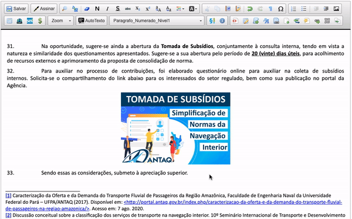

#  |  SEI Pro 

##  Redimensionar Imagens

Essa funcionalidade adiciona ao editor de texto do SEI o redimensionamento de imagens visual (arrastando e soltando)

>  

## Próximo passo

> [Inserir quebra de página](./QUEBRAPAGINA.md)
