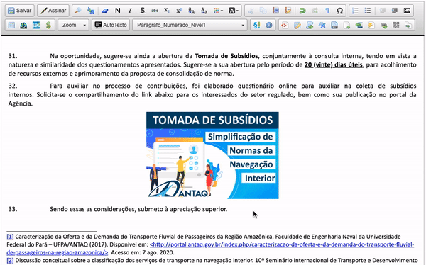

#  |  SEI Pro 

##  Redimensionar imagens

Imagens coladas no SEI costumam entrar enormes, ultrapassando a margem do documento. O SEI Pro oferece dois jeitos de acertar o tamanho.

> 

### Pelo tamanho na página

1. Dê um **duplo clique** na imagem (ou botão direito › **Formatar Imagem**);
2. Informe a **Largura** ou a **Altura** — em pixels ou em porcentagem (por exemplo, `100%` para ocupar a largura do texto);
3. Para garantir que a imagem nunca passe da margem, use **Largura Máxima**.

### Pelo tamanho do arquivo

Para diminuir a imagem de verdade — e não só a forma como ela aparece —, clique com o botão direito › **Editar Imagem** e use a ferramenta **Redimensionar**. O documento fica mais leve.

### Como ativar

As duas opções fazem parte de [Enviar, formatar e editar imagens](../pages/EDITARIMAGENS.md), que vem ligada de fábrica.

### Bom saber

* Mudar a largura na página não reduz o peso do arquivo. Se o documento estiver pesado, use o **Redimensionar** do editor de imagem ou [Reduzir a qualidade das imagens](../pages/QUALIDADEIMAGENS.md).

## Próximo item

> [Reduzir a qualidade das imagens inseridas nos documentos](../pages/QUALIDADEIMAGENS.md)
