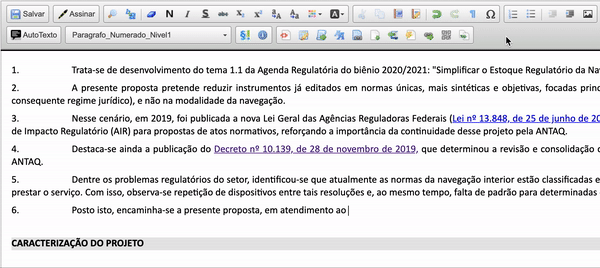

#  |  SEI Pro 

##  Inserir referência de documentos do processo

Essa funcionalidade adiciona ao editor de texto do SEI a referência de documentos do processo, com a respectiva citação do link SEI.

>  

A lista de referiencia é gerada a partir da árvore de documentos do processo.

## Próximo passo

> [Inserir nota de rodapé](./NOTARODAPE.md)
