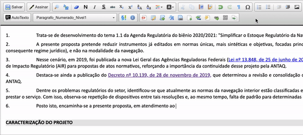

#  |  SEI Pro 

##  Inserir referência de documentos do processo

Citar outros documentos do processo é rotina: "conforme o Parecer (SEI nº 0094793)...". Com esta função você **escolhe os documentos numa lista** e o SEI Pro escreve a citação **com o link do SEI** — quem lê clica e abre o documento citado.

> 

### Como usar

1. No editor, clique onde a citação deve entrar;
2. Clique no botão **Inserir referência de documento do processo**;
3. Em **Documentos do processo**, escolha um ou mais documentos;
4. Clique em **Inserir**.

### Formato da citação

Escolha como a citação é escrita nas [Configurações do SEI Pro](../pages/DESATIVARFUNCOES.md), aba **Geral**, seção **Editor de Texto**, opção **Formato da citação de documento**:

| Opção | Exemplo |
| ----- | ------- |
| Documento (SEI nº 0000) | Despacho (SEI nº 0094793) |
| Documento (Doc. SEI nº 0000) | Despacho (Doc. SEI nº 0094793) |
| Documento (SEI 0000) | Despacho (SEI 0094793) |
| Documento (0000) | Despacho (0094793) |
| 0000 | 0094793 |

O mesmo formato é usado nas citações da [escrita interativa](../pages/ESCRITAINTERATIVA.md) e no nome dos arquivos baixados em [Baixar documento](../pages/BAIXARDOCUMENTO.md).

### Como ativar

O botão aparece sempre no editor do SEI quando o SEI Pro está instalado, em documentos de processos.

### Bom saber

* A lista é montada a partir da **árvore do processo**.
* O link é o **número SEI** do documento, no formato do próprio SEI — ele funciona para qualquer pessoa com acesso ao processo.

## Próximo item

> [Adicionar link de legislação](../pages/LINKLEGIS.md)
