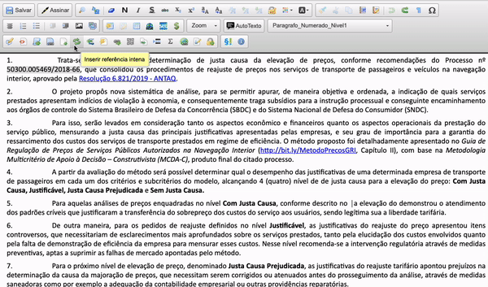

#  |  SEI Pro 

##  Adicionar referências internas

Essa funcionalidade ao editor de documentos do SEI a possibilidade de inserir referências internas à parágrafos numerados.

Semelhante às notas de rodapé, as referências internas criam links entre o parágrado de referência e o trecho referenciado.

Caso o parágrafo seja renumerado, basta atualizar as referências para que a numeração seja retificada.

>  
> 
## Próximo item

> [PAGE](../pages/PAGE.md)
